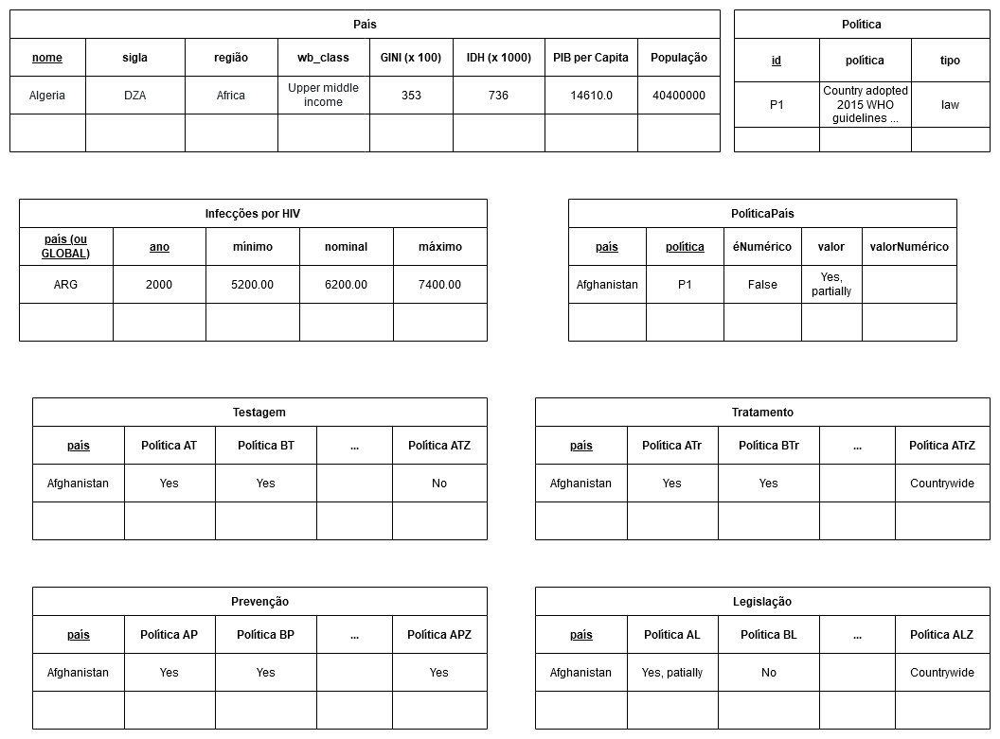

# Etapa 3 - Primeiros Modelos e Análises

## Primeiro Modelo Conceitual

### Modelo conceitual para os dados de infecções por HIV no mundo.

### Modelo conceitual para infecções de DSTs no Reino Unido.

## Primeiros Modelos Lógicos

### Modelos lógicos utilizados para o projeto

Nas tabelas Testagem, Tratamento, Prevenção e Legislação, muitas colunas foram omitidas devido à sua quantidade.

## Primeiro programa de extração e conversão de dados

Os notebooks de extração e tratamento de dados pode ser verificados na [pasta](notebook/tratamento-dados/) e os dados de saída se encontram em [data](data/processed). Os arquivos ODS obtidos na base de dados UK Gov Statistics – referentes aos casos de DSTs no Reino Unido – e o arquivo csv da UNAIDS Laws and Policies – referentes aos dados de medidas públicas – encontram se na pasta [data](data/external). Esses dados foram tratados e filtrados, respectivamente em [uk_data.ipynb](notebook/tratamento-dados/uk_data.ipynb) e [getPoliciesData.ipynb](notebook/tratamento-dados/getPoliciesData.ipynb). Os dados socioeconômicos de cada país, retirados da DBPedia em formato de grafos, foram extraídos em [getCountryData.ipynb](notebook/tratamento-dados/getCountryData.ipynb), e os dados de infecções em JSON foram extraídos pelo uso da API Athena em [newInfectionsWHO.ipynb](notebook/tratamento-dados/newInfectionsWHO.ipynb).

## Primeiro conjunto de queries

As queries podem ser vistas na [pasta de queries](notebook/sql) e seus resultados foram convertidos em arquivos csv para simplificar a visualização e se encontram na pasta [saida](saida/). Especificamente, o notebook [PoliticasxRenda.ipynb](notebook/sql/PoliticasxRenda.ipynb) faz uma query que relaciona o número de políticas públicas por classificação de renda, cujo resultado pode ser visto no arquivo [politicas-x-renda.csv](saida/politicas-x-renda.csv). O notebook [RegiaoxInfeccoes.ipynb](notebook/sql/RegiaoxInfeccoes.ipynb) faz uma query que relaciona o número de infecções de HIV em cada região a cada ano, como pode ser visto em [regiao-x-infeccoes.csv](saida/regiao-x-infeccoes.csv), e o notebook [RendaxInfeccoes.ipynb](notebook/sql/RendaxInfeccoes.ipynb) relaciona o número de infecções com dados socioeconômicos dos países, como mostrado em [socioeconomico-x-infeccoes.csv](saida/socioeconomico-x-infeccoes.csv). Por fim, o notebook [policies-query.ipynb](notebook/sql/policies-query.ipynb) faz relações entre o número de camisinhas distribuídas por habitante e as políticas associadas a camisinhas de cada país, a porcentagem de países de cada região que têm ou não políticas de distribuição de camisinhas, a porcentagem de países em cada região que tem políticas nacionais de combate à AIDS e a porcentagem de países por categoria de renda que permitem o início do tratamento antirretroviral no dia do diagnóstico de HIV, respectivamente, em [numero-de-camisinhas-politicas.csv][saida/numero-de-camisinhas-politicas.csv], [distribuicao-regiao.csv](saida/distribuicao-regiao.csv), [estrategia-regiao.csv](saida/estrategia-regiao.csv) e [tratamento-classificacao.csv](saida/tratamento-classificacao.csv).

## Bases de Dados

| Título da base           | Link                                            | Breve descrição                                                                                                 |
| ------------------------ | ----------------------------------------------- | --------------------------------------------------------------------------------------------------------------- |
| <s>AtlasPlus CDC</s>     | ~~https://www.cdc.gov/nchhstp/atlas/index.htm~~ | ~~Tabela com dados sobre DSTs nos EUA~~                                                                         |
| WHO GHO                  | https://apps.who.int/gho/athena/api/GHO         | Infecções por HIV no mundo e também informações algumas informações dos países como a região e línguas oficiais |
| UK Gov Statistics        | https://www.gov.uk/government/statistics/       | Tabelas e textos sobre casos de DSTs no Reino Unido e medidas públicas                                          |
| UNAIDS Laws and Policies | https://lawsandpolicies.unaids.org              | Dados sobre medidas públicas adotadas em cada país, inclusive sobre DSTs                                        |
| DBpedia                  | http://dbpedia.org/data/                        | Dados socioeconômicos de cada país, como o PIB per capita, Gini e o IDH                                         |

## Arquivos de Dados

| Nome do Arquivo                                                             | Link                                                                                               | Breve descrição                                                                                                    |
| --------------------------------------------------------------------------- | -------------------------------------------------------------------------------------------------- | ------------------------------------------------------------------------------------------------------------------ |
| `2019_Table_1_New_STI_diagnoses_and_rates_in_England_by_gender.ods`         | [arquivo](data/external/2019_Table_1_New_STI_diagnoses_and_rates_in_England_by_gender.ods)         | Novos casos de DSTs na Inglaterra por gênero (2010-2019 Uk Gov Statistics)                                         |
| `2019_Table_4_All_STI_diagnoses_and_services_by_gender_and_sexual_risk.ods` | [arquivo](data/external/2019_Table_4_All_STI_diagnoses_and_services_by_gender_and_sexual_risk.ods) | Novos casos de DSTs na Inglaterra por gênero e risco sexual, com divisões em regiões (2015-2019 Uk Gov Statistics) |
| `NCPI downloads.csv`                                                        | [arquivo](data/external/NCPI%20downloads.csv)                                                      | Tabela de Leis e Políticas adotadas por países com relação ao HIV (UNAIDS)                                         |
| `countries.csv`                                                             | [arquivo](data/processed/countries.csv)                                                            | Tabela com os dados dos países já processados (DBPedia + WHO GHO)                                                  |
| `country_policies.csv`                                                      | [arquivo](data/processed/country_policies.csv)                                                     | Tabela com as políticas em cada país e seus respectivos valores (UNAIDS)                                           |
| `infections.csv`                                                            | [arquivo](data/processed/infections.csv)                                                           | Tabela com número de novas infecções por HIV em cada país (WHO GHO)                                                |
| `legislacao.csv`                                                            | [arquivo](data/processed/legislacao.csv)                                                           | Tabela com legislações relacionadas ao HIV por país (UNAIDS)                                                       |
| `policies.csv`                                                              | [arquivo](data/processed/policies.csv)                                                             | Tabela com as políticas e seus respectivos tipos (UNAIDS)                                                          |
| `prevencao.csv`                                                             | [arquivo](data/processed/prevencao.csv)                                                            | Tabela com políticas de prevenção do HIV por país (UNAIDS)                                                         |
| `testagem.csv`                                                              | [arquivo](data/processed/testagem.csv)                                                             | Tabela com políticas de testagem do HIV por país (UNAIDS)                                                          |
| `tratamento.csv`                                                            | [arquivo](data/processed/tratamento.csv)                                                           | Tabela com políticas de tratamento do HIV por país (UNAIDS)                                                        |
| `uk_sti_cases_per_100000.csv`                                               | [arquivo](data/processed/uk_sti_cases_per_100000.csv)                                              | Casos de DSTs no Reino Unido por 100000 habitantes (Uk Gov Statistics)                                             |
| `uk_sti_cases.csv`                                                          | [arquivo](data/processed/uk_sti_cases.csv)                                                         | Casos de DSTs no Reino Unido (Uk Gov Statistics)                                                                   |
| `Number of new HIV infections`                                              | [link](https://apps.who.int/gho/athena/api/GHO/HIV_0000000026?format=json)                         | Novos casos de infecção por HIV (WHO GHO)                                                                          |