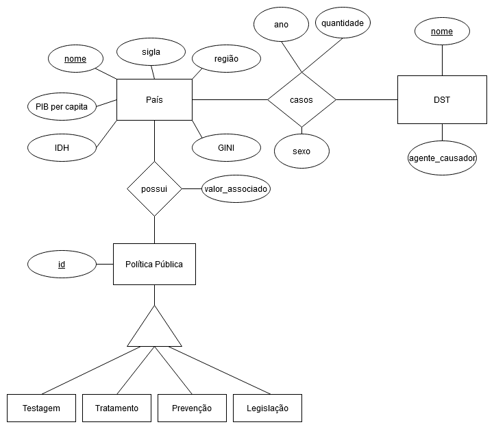

# Etapa 3 - Primeiros Modelos e Análises

## Modelos Conceituais

.

## Modelos Lógicos
.

## Tratamento de Dados

Os notebooks de extração e tratamento de dados pode ser verificados na [pasta](notebook/tratamento-dados/) e os dados de saída se encontram em [Filtered Data](../data/Filtered%20Data/).

## Queries

As queries podem ser vistas na [pasta de queries](notebook/sql).