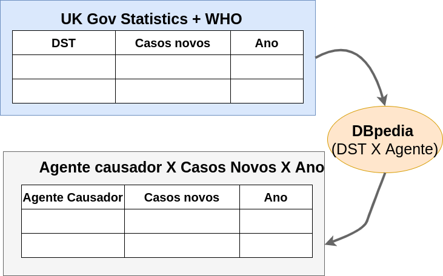
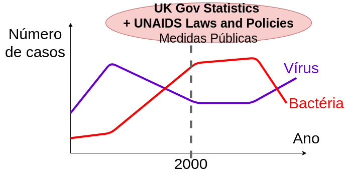

# Etapa 2 - Descrição da Proposta

## Slides da Proposta
Os slides da proposta pode sem vistos em [slides](slides/proposta_apresentação.pdf).

## Motivação e Contexto
Visualizar possíveis correlações entre o número de casos de DSTs, aspectos socioeconômicos e políticas públicas, a fim de determinar fatores chave no controle de novos casos.

## Método
[TODO]: <> (atualizar a metodologia do Reino Unido assim que possível!)
Utilizar dados sobre novas infecções no Reino Unido através do site do governo e classificar de acordo com o agente causador (eg. vírus, bactéria, fungo) relacionando o nome da infecção com o grafo da DBpedia e por fim plotar gráfico de linhas de números de casos em função do ano, também nesse gráfico anotaremos medidas públicas relevantes para correlacionar avanço de casos e medidas do governo.

Também realizaremos uma análise no contexto mundial, onde iremos relacionar diversos aspectos socioeconômicos (como distribuição do PIB através do valor per capita e o índice de desigualdade econômica, Gini, e também através do IDH) e medidas públicas (como testes de HIV e disponibilidade de tratamento retroviral) com o número de casos de HIV em cada país em um determinado ano.

## Bases de Dados
| título da base           | link                                                                          | breve descrição             |
| ------------------------ | ----------------------------------------------------------------------------- | --------------------------- |
|<s>AtlasPlus CDC</s>            | ~~https://www.cdc.gov/nchhstp/atlas/index.htm~~                                   | ~~Tabela com dados sobre DSTs nos EUA~~ |
| WHO GHO                  | https://apps.who.int/gho/athena/api/GHO                                       | Infecções por HIV no mundo e também informações algumas informações dos países como a região e línguas oficiais  |
| UK Gov Statistics        | https://www.gov.uk/government/statistics/                                     | Tabelas e textos sobre casos de DSTs no Reino Unido e medidas públicas |
| UNAIDS Laws and Policies | https://lawsandpolicies.unaids.org                                            | Dados sobre medidas públicas adotadas em cada país, inclusive sobre DSTs |
| DBpedia                  | http://dbpedia.org/data/| Dados socioeconômicos de cada país, como o PIB per capita, Gini e o IDH |