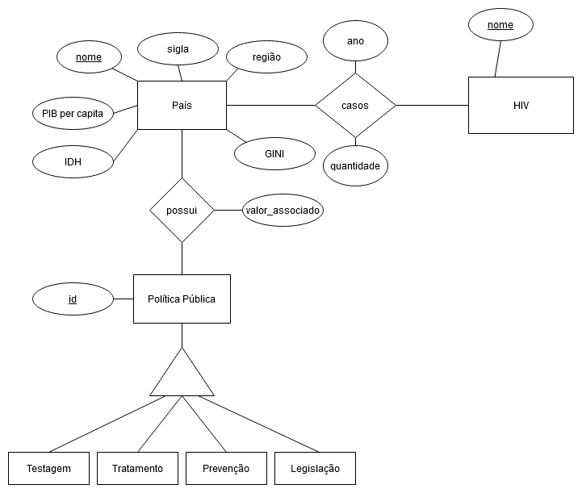
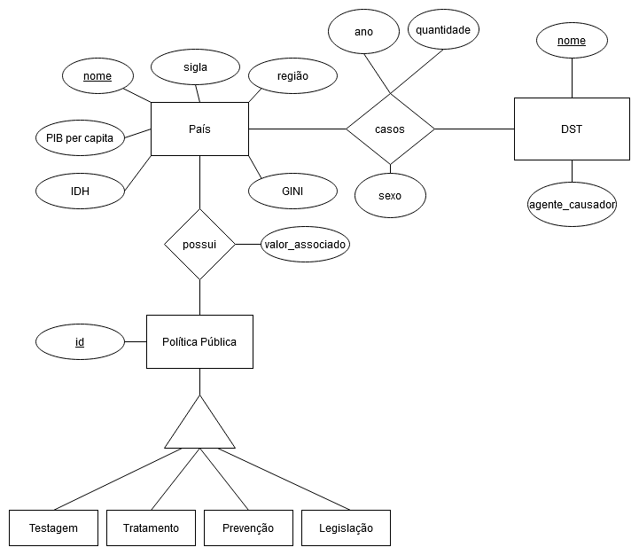

# Etapa 04 - Análises com o Segundo Modelo Lógico

## Slides da Apresentação da Proposta
Os slides da proposta pode sem vistos em [slides](./slides/etapa-4.pdf).

## Modelo Conceitual Atualizado

#### Modelo conceitual para os dados de infecções por HIV no mundo.

#### Modelo conceitual para infecções de DSTs no Reino Unido.

### Modelos Lógicos Atualizados

#### Modelos lógicos utilizados para o projeto
Nas tabelas Testagem, Tratamento, Prevenção e Legislação, muitas colunas foram omitidas devido à sua quantidade.

## Programa de extração e conversão de dados atualizado

Os notebooks de extração e tratamento de dados pode ser verificados na [pasta](notebook/tratamento-dados/) e os dados de saída se encontram em [Filtered Data](../data/Filtered%20Data/). Os arquivos ODS obtidos na base de dados UK Gov Statistics – referentes aos casos de DSTs no Reino Unido – e o arquivo csv da UNAIDS Laws and Policies – referentes aos dados de medidas públicas – encontram se na pasta [data](../data/). Esses dados foram tratados e filtrados, respectivamente em [uk_data.ipynb](notebook/tratamento-dados/uk_data.ipynb) e [getPoliciesData.ipynb](notebook/tratamento-dados/getPoliciesData.ipynb). Os dados socioeconômicos de cada país, retirados da DBPedia em formato de grafos, foram extraídos em [getCountryData.ipynb](notebook/tratamento-dados/getCountryData.ipynb), e os dados de infecções em JSON foram extraídos pelo uso da API Athena em [newInfectionsWHO.ipynb](notebook/tratamento-dados/newInfectionsWHO.ipynb).

## Conjunto de queries de dois modelos

* Estágio 3
  
  As queries podem ser vistas na [pasta de queries](notebook/sql) e seus resultados foram convertidos em arquivos csv para simplificar a visualização e se encontram na pasta [saida](saida/). Especificamente no *estágio 3*, o notebook [PoliticasxRenda.ipynb](notebook/sql/PoliticasxRenda.ipynb) faz uma query que relaciona o número de políticas públicas por classificação de renda, cujo resultado pode ser visto no arquivo [politicas-x-renda.csv](saida/politicas-x-renda.csv). O notebook [RegiaoxInfeccoes.ipynb](notebook/sql/RegiaoxInfeccoes.ipynb) faz uma query que relaciona o número de infecções de HIV em cada região a cada ano, como pode ser visto em [regiao-x-infeccoes.csv](saida/regiao-x-infeccoes.csv), e o notebook [RendaxInfeccoes.ipynb](notebook/sql/RendaxInfeccoes.ipynb) relaciona o número de infecções com dados socioeconômicos dos países, como mostrado em [socioeconomico-x-infeccoes.csv](saida/socioeconomico-x-infeccoes.csv). Por fim, o notebook [policies-query.ipynb](notebook/sql/policies-query.ipynb) faz relações entre o número de camisinhas distribuídas por habitante e as políticas associadas a camisinhas de cada país, a porcentagem de países de cada região que têm ou não políticas de distribuição de camisinhas, a porcentagem de paises em cada região que tem políticas nacionais de combate à AIDS e a porcentagem de países por categoria de renda que permitem o início do tratamento antiretroviral no dia do diagnóstico de HIV, respectivamente, em [numero-de-camisinhas-politicas.csv][saida/numero-de-camisinhas-politicas.csv], [distribuicao-regiao.csv](saida/distribuicao-regiao.csv), [estrategia-regiao.csv](saida/estrategia-regiao.csv) e [tratamento-classificacao.csv](saida/tratamento-classificacao.csv).

* Estágio 4
  
  Já no estágio 4, realizamos queries para o modelo lógico de grafos utilizando o *Neo4j* e essas queries estão na pasta [src](src). Na query [clustering_socioeconomics.md](src/clustering_socioeconomics.md), busca-se encontrar maneiras de agrupar diferentes países com características socioeconômicas (Gini, IDH e PIB per Capita PPC) semelhantes entre si para depois linkar diferentes grupos e tentar correlacionar a quantidade de infecções através desses dados. Para isso, ligamos países (vértices) com valor socioeconômico semelhante com arestas, cujas arestas têm peso maior conforme mais próximo são os valores, e esse grafo foi processado através de uma biblioteca com Louvain considerando ou não os pesos das arestas. As saídas foram convertidas em csv e depois os resultados foram processados no Cytoscape para a visualização, onde quanto maior o tamnho do vértice maior será o IDH do país e cores diferenciam diferentes grupos, lembrando que as cores escolhidas não tem uma lógica por trás, por exemplo a escolha por uma cor mais escura não quer dizer que um grupo é pior ou melhor que outro. As saídas são:
    - Grafo com arestas ligando países com IDH parecidos e classificando países através do Gini e IDH considerando o peso entre arestas [rel_idh_class_gini_idh_peso.png](./assets/rel_idh_class_gini_idh_peso.png); 
    - Grafo com arestas ligando países com Gini parecidos e classificando países através do Gini e IDH considerando o peso entre arestas [rel_gini_class_gini_idh_peso.png](./assets/rel_gini_class_gini_idh_peso.png); 
    - Grafo com arestas ligando países com IDH parecidos e classificando países através do Gini, do IDH e do PIB per Capita PPC considerando o peso entre arestas [rel_idh_class_tudo_peso.png](./assets/rel_idh_class_tudo_peso.png); 
    - Grafo com arestas ligando países com Gini parecidos e classificando países através do Gini, do IDH e do PIB per Capita PPC considerando o peso entre arestas [rel_gini_class_tudo_peso.png](./assets/rel_gini_class_tudo_peso.png); 
    - Grafo com arestas ligando países com IDH parecidos e classificando países do PIB e da desigualdade econômica (Gini) desconsiderando o peso entre arestas [rel_idh_class_money_peso.png](./assets/rel_idh_class_money_peso.png);
    - Grafo com arestas ligando países com Gini parecidos e classificando países do PIB e da desigualdade econômica (Gini) desconsiderando o peso entre arestas [rel_gini_class_money_peso.png](./assets/rel_gini_class_money_peso.png);

  Outra query tenta agrupar países cujas políticas públicas sejam semelhantes adicionando arestas entre dois países cujo peso é proporcional ao número de leis compartilhadas e inversamente proporcional ao número de leis divergentes entre elas, assim o objetivo é tentar encontrar e correlacionar padrões nas leis com a quantidade de infecções de um país.
  
  Por fim, a última query cria um grafo ligando um país A com todos os países X tal que A e X compartilham fronteira (são países vizinhso).Criando essa fronteira, analisa-se a importância de cada país pela sua centralidade com os demais países através de uma biblioteca com o algoritmo de PageRank e tentar correlacionar a centralidade com a quantidade de infecções, espera-se que se um país importante (de acordo com o critério de centralidade) e este apresenta um número grande de casos de HIV, os seus países vizinhos também tenham um número de casos elevados.

## Bases de Dados
| Título da base           | Link                                                                          | Breve descrição             |
| ------------------------ | ----------------------------------------------------------------------------- | --------------------------- |
|<s>AtlasPlus CDC</s>            | ~~https://www.cdc.gov/nchhstp/atlas/index.htm~~                                   | ~~Tabela com dados sobre DSTs nos EUA~~ |
| WHO GHO                  | https://apps.who.int/gho/athena/api/GHO                                       | Infecções por HIV no mundo e também informações algumas informações dos países como a região e línguas oficiais  |
| UK Gov Statistics        | https://www.gov.uk/government/statistics/                                     | Tabelas e textos sobre casos de DSTs no Reino Unido e medidas públicas |
| UNAIDS Laws and Policies | https://lawsandpolicies.unaids.org                                            | Dados sobre medidas públicas adotadas em cada país, inclusive sobre DSTs |
| DBpedia                  | http://dbpedia.org/data/| Dados socioeconômicos de cada país, como o PIB per capita, Gini e o IDH |

## Arquivos de Dados

 **nome do arquivo** |  **link** | **breve descrição** 
 -----|-----|-----
 CountriesNeightbourhood.csv|[aqui](../data/Filtered%20Data/../Filtered%20Data/CountriesNeightbourhood.csv)| Grafo em forma de csv que liga países que são vizinhos entre si.