# Etapa Final

## Projeto Final de MC536

## Equipe Cavaleiros da Query Estruturada

* Willian Takayuki Ozako - 207267

* Frederico Meletti Rappa - 216047

* João Alberto Moreira Seródio - 218548

## Slides da Apresentação da Etapa Final

Os slides da estapa podem ser vistos em [slides](./slides/etapa-final.pdf).

## Resumo do Projeto

O projeto tem como finalidade a visualização de correlações entre o número de casos de DSTs, aspectos socioeconômicos de países e suas políticas públicas de combate a essas doenças. Para isso, foram utilizados principalmente dados da [OMS](https://apps.who.int/gho/athena/api/GHO), [UNAIDS Laws and Policies](https://lawsandpolicies.unaids.org) e [DBpedia](http://dbpedia.org/data/), que foram tratados com notebooks em Python e relacionados em queries SQL e, posteriormente, em grafos. Os resultados, apesar das dificuldades encontradas na execução do projeto, permitiram análises interessantes das possíveis relações entre casos de HIV e localização geográfica, políticas públicas e características socioeconômicas.

## Motivação e Contexto

Visualizar possíveis correlações entre o número de casos de DSTs, aspectos socioeconômicos e políticas públicas, a fim de determinar fatores chave no controle de novos casos.

## Detalhamento do Projeto

Na query [RendaxInfecções](notebook/sql/RendaxInfeccoes.ipynb), a ideia era de criar um registro de casos de infecções de HIV em função do país (em sigla) em um determinado ano e sabendo dos dados socioeconômicos (PIB per Capita PPC, Gini* e IDH), com o Gini modificado, já que tanto para o IDH e para o PIB temos que quanto maior o valor melhor é o país, porém o Gini em sua definição é pior à medida que seu valor aumenta, então para condizer com os demais dados modificamos ao calcular (1-Gini). Nessa query todos os valores socioeconômicos foram normalizados através da fórmula (valor - mínimo) / (máximo - mínimo) como pode ver no código abaixo, sendo que os valores máximos e mínimos são encontrados no conjunto de todos os países.

~~~sql
CREATE VIEW socioeconomicoXinfeccoes AS
SELECT T.ano, T.sigla,
       (1.0 - T.gini - PNPG.minConvGini)/(PNPG.maxConvGini - PNPG.minConvGini) Corr_Gini,
       CAST(T.pibpercapita - PNPG.minpib AS DOUBLE) / CAST(PNPG.maxpib - PNPG.minpib AS DOUBLE) Norm_PIB,
       (T.taxaInfeccoes - PNI.minInf)/(PNI.maxInf-PNI.minInf) Norm_infeccoes,
       (T.IDH - PNPG.minIDH) / (PNPG.maxIDH - PNPG.minIDH) Norm_IDH
FROM tabelaInicial T, parNormInfeccoes PNI, parNormPibGini PNPG
WHERE T.ano = PNI.ano
ORDER BY ano, corr_gini, norm_pib
~~~

Na query [RegiãoxInfecções](notebook/sql/RegiaoxInfeccoes.ipynb) procuramos o total de infecções de HIV de uma certa região definida pela OMS (subcontinentes) em relação ao total de infecções no mundo em um dado ano.

~~~sql
CREATE VIEW RegiaoxInfeccoes AS
SELECT DP.ano, P.regiao, 
       CAST(SUM(DP.quantidade) AS DOUBLE) / CAST(SUM(DG.quantidade) AS DOUBLE)*100.0 Infeccoes
FROM Pais P, DST DP, DST DG
WHERE P.sigla = DP.regiao 
      AND DG.ano = DP.ano 
      AND DP.quantidade IS NOT NULL
GROUP BY P.regiao, DP.ano
ORDER BY DP.ano,
         P.regiao;
 
SELECT * FROM RegiaoxInfeccoes;
~~~

Em [GrupoXInfecção](notebook/sql/gruposXinfeccao.ipynb), buscamos apontar características de cada grupo (sendo que essa classificação foi resultado da aplicação de Louvain em um grafo que liga países com Gini e IDH parecidos e considerando o peso das arestas nessa clusterização) através dos valores médios de IDH e do Gini, lembrando que tivemos o cuidado de selecionar apenas grupos com pelo menos 2 membros, pois um grupo de um único país significa que provavelmente não conseguimos retirar dados desse país para agrupá-lo com outros países.

~~~sql
CREATE VIEW GrupoXinfeccao AS
SELECT G.id id, count(*) number_of_countries, 
       AVG(P.idh) idh, AVG(P.gini) gini,
       sum(I.qtde) qtde_infeccoes
FROM Pais AS P, Grupo AS G, Infeccoes AS I
WHERE P.sigla = I.regiao AND P.nome = G.pais AND I.ano=2014
GROUP BY G.id
HAVING number_of_countries > 1
ORDER BY idh, gini desc;
~~~

Em [policies-query](notebook/sql/policies-query.ipynb), foram feitas queries que relacionavam características socioeconômicas de países com suas políticas públicas de prevenção, tratamento e teste de DSTs. Mais especificamente, buscou-se relacionar o número total de camisinhas distribuídos com a existência ou não de uma política nacional de distribuição por país; a porcentagem de países de cada região que tem uma política nacional de distribuição de preservativos; a porcentagem de países por região que tem uma estratégia ou plano dedicado a AIDS; e a porcentagem de países por classificação de renda que permite o início do tratamento antirretroviral de pacientes no mesmo dia que são diagnosticados com HIV. Com essas análise, buscava-se entender se existem relações entre as classificações de países e como são suas políticas de combate a DSTs.

~~~sql
SELECT Pr.country, 
    CAST(Pr."Number of male condoms distributed in the previous calendar year: total" AS FLOAT) / Pa.populacao  AS "Número de camisinhas masculinas por habitante", 
    CAST(Pr."Number of female condoms distributed in the previous calendar year: total" AS FLOAT) / Pa.populacao  AS "Número de camisinhas femininas por habitante",  
    CAST(Pr."Number of male condoms distributed in the previous calendar year: total" + Pr."Number of female condoms distributed in the previous calendar year: total" AS FLOAT) / Pa.populacao  AS "Número de camisinhas por habitante",
    Pr."National condom strategy/plan",
    Pr."Prosecution/punishment of individuals for carrying condoms"
FROM Prevencao Pr, Pais Pa WHERE Pr.country = Pa.nome AND (Pr."Number of male condoms distributed in the previous calendar year: total" IS NOT NULL OR Pr."Number of female condoms distributed in the previous calendar year: total" IS NOT NULL);
~~~

~~~sql
SELECT APR.regiao, APR."Tem uma política ou estratégia nacional de distribuição de camisinhas?", APR.Quantidade, CAST(APR.Quantidade*100 AS FLOAT) / PPR."Quantidade de paises na região" "Porcentagem de países" 
FROM AgrupadoPorRegiao APR, PaisesPorRegiao PPR 
WHERE APR.regiao = PPR.regiao;
~~~

~~~sql
SELECT PNA.regiao, PNA."National strategy/policy guiding AIDS response", PNA.Quantidade, CAST(PNA.QUANTIDADE*100 AS FLOAT) / PPR."Quantidade de paises na região" "Porcentagem de países"
FROM PoliticaNacionalAIDS PNA, PaisesPorRegiao PPR 
WHERE PPR.regiao = PNA.regiao;
~~~

~~~sql
SELECT ART.classificacaoRenda, ART."Possible to start ART on the same day as HIV diagnosis", ART.QUANTIDADE "Número de países", CAST(ART.QUANTIDADE*100 AS FLOAT) / CR.QUANTIDADE "Porcentagem de países"
FROM PossibleToStartART ART, (SELECT classificacaoRenda, COUNT(*) quantidade FROM Pais GROUP BY classificacaoRenda) CR
WHERE ART.classificacaoRenda = CR.classificacaoRenda;
~~~

Com a query [PolíticasxRenda](notebook/sql/PoliticasxRenda.ipynb) verificamos o número de políticas adotadas por cada país para então calcular o número médio de políticas adotadas por países de um mesmo grupo econômico segundo o World Bank.

~~~sql
CREATE VIEW PoliticasPaises AS
SELECT Pais.nome nome, Pais.classificacaoRenda renda, COUNT (*) politicas
    FROM Pais JOIN CountryPolicies CP ON Pais.nome = CP.country
    WHERE CP.isNumeric = False AND
          CP.value <> 'No'
    GROUP BY Pais.nome;
    
CREATE VIEW PoliticasRenda AS
SELECT P1.renda, SUM(P1.politicas)/(SELECT COUNT(*) FROM PoliticasPaises P2 WHERE P2.politicas <> 0 AND P2.renda = p1.renda) Media_Politicas
    FROM PoliticasPaises P1
    WHERE P1.politicas <> 0
    GROUP BY P1.renda;
CALL CSVWRITE('../../saida/politicas-x-renda.csv', 'SELECT * FROM PoliticasRenda');
SELECT * FROM PoliticasRenda;
~~~

Em [clustering_socioeconomics](src/clustering_socioeconomics.md), tentamos construir grafos onde os países são vértices e arestas conectam países cujos valores de um dado socioeconômico têm diferença menor que um MAX e o peso dessa aresta era então (MAX-diferença). Assim, aplicando Louvain nesse grafo para diferentes combinações de tipos de arestas (PIB, IDH ou Gini) e considerando peso ou não, analisamos os resultados finais e concluímos que a combinação de arestas de Gini combinadas com o de IDH e considerando o peso das arestas levou a um resultado mais satisfatório. No seguinte recorte, vemos a criação de uma aresta conectando dois países com valores de Gini próximos com o MAX=10.

~~~cypher
MATCH (a: Country)
MATCH (b: Country)
WHERE a.name < b.name AND a.gini IS NOT NULL AND b.gini IS NOT NULL AND abs(toInteger(a.gini) - toInteger(b.gini)) < 10
CREATE (a)-[i:Inequality]->(b)
SET i.weight = 10 - abs(toInteger(a.gini) - toInteger(b.gini))
~~~

Em [Politicas-Paises](src/Politicas-Paises.md), foi construído um grafo que liga cada país com arestas cujo peso é o número de políticas públicas compartilhadas: por exemplo, se dois países proíbem a venda de anticoncepcionais a menores de 18 anos, essa política será considerado como compartilhada e, portanto, contabilizada na aresta que liga esses países. Com isso, buscava-se visualizar se países de uma mesma região, classificação socioeconômica ou com IDH próximos, por exemplo, têm abordagens similares em relação a DSTs, o que poderia ser indicado pelo número de políticas. O código em cypher que relaciona os países pelo número de políticas é mostrado abaixo.

~~~cypher
match (CP1:Pol)
match (CP:Pol)
MATCH (c1:Country)
MATCH (c:Country)
WHERE c.country <> c1.country AND c.country = CP.country AND c1.country = CP1.country AND CP1.country <> CP.country AND CP.politica IS NOT NULL AND CP1.politica IS NOT NULL AND CP.politica = CP1.politica AND CP.value = CP1.value
MERGE (c1)-[t:Politicas]->(c)
ON CREATE SET t.weight=1
ON MATCH SET t.weight=t.weight+1
~~~

Em [regional_infections](src/regional_infections.md) construímos um grafo conectando países vizinhos e então colocamos cada nó com tamanho proporcional ao seu número de novas infecções de HIV no ano de 2015, a fim de verificar em que regiões há uma grande concentração desses novos casos.

~~~cypher
CALL gds.louvain.stream('neighbourhoodGraph')
YIELD nodeId, communityId
RETURN gds.util.asNode(nodeId).label AS label, gds.util.asNode(nodeId).name AS name, gds.util.asNode(nodeId).region AS region, gds.util.asNode(nodeId).infections AS infections, communityId
ORDER BY communityId ASC
~~~

## Evolução do Projeto

Durante a realização das primeiras fases do projeto, houve dificuldades em encontrar os datasets necessários para a análise de DST em contexto global, já que encontramos poucos dados referentes às diferentes doenças sexualmente transmissíveis e a grande maioria era focada no HIV/Aids, e encontramos apenas dados sobre DSTs em geral do Reino Unido e dos EUA, ou seja, insuficientes para a nossa análise no contexto mundial e assim concluímos que seria melhor realizar análise sobre HIV no mundo e DSTs no Reino Unido. Também que fonte e como utilizaríamos os dados a partir de um grafo não ficou bem definido e, como apontado pelo professor, descobrir que tipo de agente causador da DST (vírus, bactéria ou fungo) poderia ser realizada manualmente ao invés de criar um programa de extração dessas informações no site da *DBpedia*.

Na fase 3, programamos as primeiras versões de extração e tratamentos de dados em Python para serem utilizadas nas demais fases do projeto. Em relação ao uso de um banco de dados de grafos, chegamos a conclusão de que seria melhor continuar com a *DBpedia*, porém ao invés de extrair informações de doenças, seria melhor extrair dados socioeconômicos dos países, visto que esse trabalho seria trabalhoso demais (eram 170 países para serem pesquisados) e também convergia para um dos objetivos finais (visualizar correlações entre dados socioeconômicos e casos de DSTs). A primeira dificuldade que enfrentamos foi que muitas páginas em JSON da DBpedia estavam "quebradas", provavelmente porque têm símbolos não compatíveis com esse formato, e mesmo realizando a extração por meio do formato XML não houve uma melhora significativa, além de que muitos países não forneciam alguns dados (como o Gini). Outro problema foi como utilizar os dados sobre políticas públicas extraídos da UNAIDS, já que era uma tabela muito grande e foi parcialmente resolvido ao dividir a tabela em quatro, cada um tratando de um dos temas: "testagem", "tratamento", "prevenção" e "legislação". Ainda não tínhamos certeza se utilizaríamos os dados do Reino Unido, já que seria necessário reescrever tudo à mão no formato csv.

Ainda durante a fase 3, agora na parte de realizar queries no modelo relacional, o maior problema foi definir que tipos análises poderiam ser feitas nos dados sobre legislações, visto que como os dados eram não numéricos (assim era mais difícil de propor alguma análise como foi o caso de dados socioeconômicos VS infecções) e não seguiam um padrão bem definido de respostas como "sim", "não", "parcialmente" e, para contornar esse problema, tivemos que substituir as respostas dos campos por respostas mais simples como "sim" e "não".

Na fase 4, tivemos o foco sobre queries em grafos e maior dificuldade foi definir o que seria feito com o grafo e que objetivos deveriam ser cumpridos nessa etapa, pois o pensamento do grupo estava todo direcionado em modelos relacionais e, no fim, pensamos em tentar utilizar algoritmos de agrupamento como o Louvain para tentar classificar diferentes países de acordo com similaridades dos dados socioeconômicos e políticas públicas similares. Também houve dificuldade em encontrar um algoritmo que classificasse países de acordo com a proximidade entre dois países (de acordo com dados socioeconômicos) e, por fim, adaptamos o peso das arestas para que quanto mais próximos os valores, maior seria o nó. Outro problema foi devido à instalação e o uso do Cytoscape, pois a interface não permite (até onde se sabe) de importar os nós e depois importar as arestas com outra tabela, assim fomos obrigados a criar uma tabela com todos os valores necessários (nós e arestas) para ser importada no Cytoscape. 

Na fase final, concluímos que não valeria a pena tentar analisar os dados sobre o Reino Unido, visto que os dados deveriam ser escritos manualmente e também os dados eram pequenos (basicamente era um relatório pronto do governo do Reino Unido). Assim os modelos lógicos e conceituais do Reino Unido foram descartados. Por recomendação do professor, também adicionamos um grafo que ligava países que compartilham fronteiras para ver se haveria uma possível relação entre o número de casos de DSTs de um país e de seus vizinhos.

## Resultados e Discussão

O gráfico de ***Quantidade de infecções por HIV em relação ao valor mundial por região*** mostra o número de casos em uma dada região em relação ao total de infecções no mundo no ano de 2014. Podemos ver que a grande maioria, quase 80% dos casos de HIV no mundo, ocorreram no continente da África, depois vem a Ásia e as Américas, ambos com aproximadamente 20%.

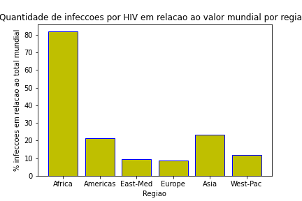

No gráfico ***Dados socioeconômicos x Novas Infecções*** (valores de 2014), procuramos ilustrar uma relação direta entre dados socioeconômicos e a quantidade de novas infecções. Para isso, multiplicamos pegamos o IDH e o "Gini" (1-Gini), ambos os valores foram normalizados, e plotamos o gráfico de novas infecções (normalizada) em função de IDH*(1-Gini). Podemos ver que há uma certa tendência de quanto maior o produto entre "Gini" e IDH, menor é a quantidade de infecções, o que era de se esperar, já que quanto maior o IDH e menor é a desigualdade econômica, esperamos que a saúde da população seja melhor que países com IDH mais baixo e desigualdade econômica mais alta.

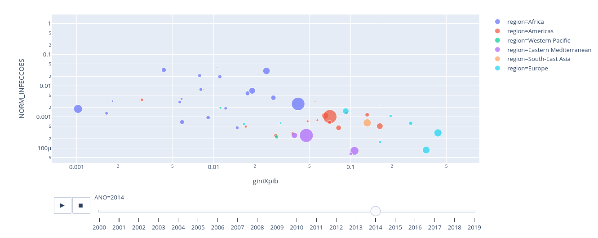

Realizando os testes de clusterização dos países de acordo com valores próximos de dados socioeconômicos, chegamos a conclusão de que o melhor agrupamento foi com a utilização de arestas que ligam países com IDH próximos e outro tipo de aresta que liga países com Gini próximo e considerando os pesos das arestas (quanto mais próximo o valor maior é o peso) no algoritmo de Louvain. Os resultados das classificações podem ser vistas nas duas figuras a seguir, que são grafos onde diferentes cores representam grupos distintos: o primeiro grafo é o grafo que conecta países de acordo com o Gini; o segundo é conectado com valores de IDH próximos.

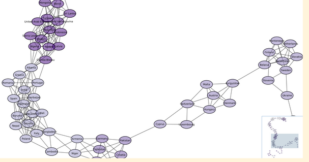

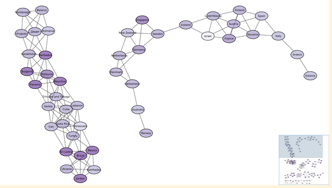

Dessa classificação, obtemos a seguinte tabela, onde podemos ver os diferentes grupos e os valores médios de IDH e de Gini do grupo, o número de infecções apresentado a seguir não é muito relevante, pois seria necessário considerar o total de população. Outro ponto relevante dessa análise é de que conseguimos agrupar apenas 75 países do 170 países iniciais, os problemas que podem ter levado a isso é a falta de informações extraídas na DBpedia (um dos fatores apontados anteriormente são os formatos de JSON e de XML quebrados como o que ocorreu na página do Reino Unido) e também pode ser devido a características peculiares de alguns países que os tornaram únicos, como a grande parte dos países de maior IDH tem Gini (desigualdade econômica) baixo, mas temos casos como os EUA e a Austrália que são contraexemplos. Abaixo vemos a tabela resultante.

Em relação políticas públicas, os resultados principais das análises de [distribuição de preservativos](./saida/camisinha.png), [políticas focadas em HIV](./assets/tabela_politica_hiv.png) e [tratamento antirretroviral](./assets/tabela_tratamento.png) podem ser vistos nas imagens, e o de número de camisinhas distribuídas pode ser melhor visto no [csv](saida/numero-de-camisinhas-politicas.csv) pela extensão da tabela. Em relação à distribuição de preservativos, nota-se claramente que em todas as regiões, mais países possuem políticas de distribuição de camisinhas, e a região cuja diferença na quantidade de países é menor é o leste do Mediterrâneo. Pelo gráfico, o sudeste asiático também não tem países que não possuam essa política, mas é possível que esse resultado seja devido à falta desse dado para alguns países. 

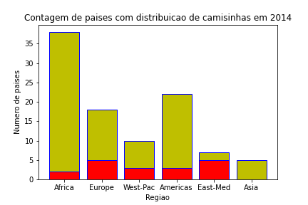

Como resultado da query de políticas com o agrupamento de países de acordo com sua classificação pelo World Bank, obteve-se uma [tabela](saida/politicas-x-renda.csv) que mostra o número médio de políticas para cada um desses 4 grupos. Nessa tabela observa-se uma quantidade média de políticas reduzida nos países de alta renda se comparada com os demais grupos.

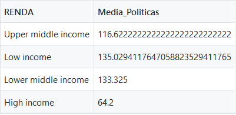

Partindo agora de uma análise geográfica, verificou-se que a África Subsaariana é a região com maior número de novos casos, como pode ser visto na imagem abaixo, e a América do Sul e o Sudeste Asiático ficam quase empatados em segundo lugar. Porém, cabe destacar que muitos países não possuem o número de novos casos divulgados, o que prejudica essa análise.

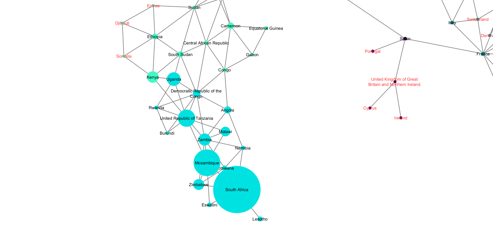

Em relação à política de resposta ao HIV, nota-se que a maioria dos países tem uma política própria para o vírus e, se não, muitos têm uma política mais abrangente que integra este combate. Em relação a resultados de destaque, nota-se que pelo menos 10% dos países do leste do Mediterrâneto e cerca de 13% dos do Pacífico não possuem políticas voltadas ao HIV, enquanto apenas 2% dos países africanos não o possuem.

Sobre o tratamento antirretroviral, nota-se também que não houve tanta diferença entre as categorias: a maioria dos países de todas as categorias permitem o início do tratamento no dia do diagnóstico. O baixo número de países de alta renda que o permitem, cerca de 20%, poderia ser explicado pela falta desses dados disponíveis para esses países, dado que apenas 30% deles possuíam essa informação.

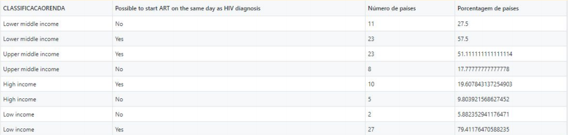

Finalmente, nota-se na [tabela do número de camisinhas](saida/numero-de-camisinhas-politicas.csv) por habitante que todos os países disponibilizam mais camisinhas masculinas, e que a maioria deles possui uma política pública de distribuição. Valores interessantes são o da Gana, com 47 camisinhas por habitante; Malásia, com 28; Uruguai, com 7,7; Lesoto com 14 e Irlanda, com 0,04 camisinhas por habitante. No entanto, não é possível tirar conclusões sobre a eficácia das políticas por esses dados, considerando que não é possível estabelecer um número "ideal" de camisinhas por habitante, e esse número pode ser menos relevante na mudança do número de casos de DSTs que políticas como campanhas de educação da população, facilidade de acesso aos preservativos e de diagnóstico e tratamento das doenças, por exemplo. Por fim, uma análise geral dos resultados das queries de políticas públicas mostra que não foi possível relacionar diretamente a prevalência de certas políticas com alguma região ou  grupo de países, o exemplo: a grande maioria dos países possuía as mesmas políticas públicas, de modo que é difícil relacionar a presença ou ausência de uma ao número de casos de HIV, por exemplo. Além disso, a falta de dados de alguns países, especialmente os de maior IDH, impossibilitou comparações que poderiam ser interessantes, como a comparação das políticas dos países mais e menos ricos e os números de casos de DSTs normalizados, por exemplo.

Os resultados da query em grafo de agrupamento de países cujas políticas públicas sejam semelhantes é mostrado na [imagem](./assets/total.png). Pelo número de países e arestas, não é possível ver o nome de cada país, mas foram agrupados em relação à sua renda, sendo os nos cantos superior esquerdo, superior direito, inferior esquerdo e inferior direito países de renda alta, de renda baixa-média, renda baixa e média-alta, respectivamente. Vértices com coloração mais arroxeada têm IDH mais elevado, e arestas mais avermelhadas representam maior número de políticas coincidentes.
Nota-se que os países com renda mais alta compartilham relativamente poucas políticas com países de outros grupos, como evidenciado pela cor clara de suas arestas. Além disso, há poucos países do grupo que têm muitas políticas iguais, o que pode ser visto pelas poucas arestas vermelhas na [imagem](./assets/highincome.png). Por outro lado, nota-se uma grande coincidência de políticas entre países de rendas baixa e baixa-média, e um grande número de países de baixa renda com políticas semelhantes, como pode ser visto em [lowincome.png](./assets/lowincome.png). Entretanto, não é possível dizer se esses números realmente significam que alguns países compartilham mais políticas que os outros ou se países com menos políticas compartilhadas somente não tinham seus dados completos.

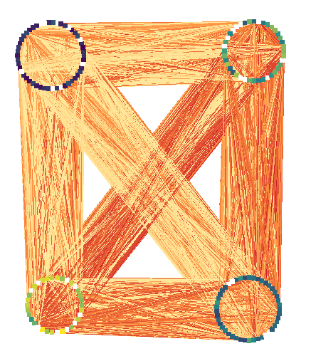

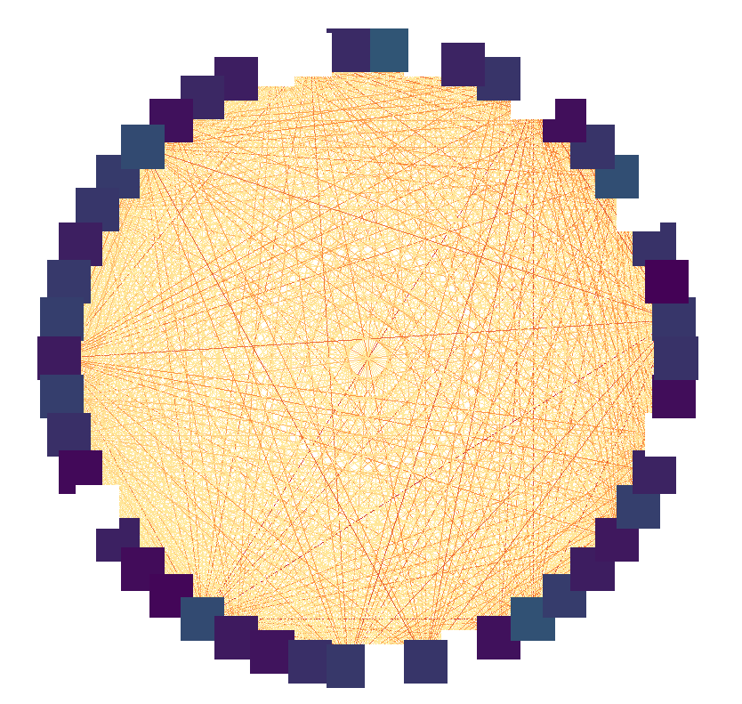

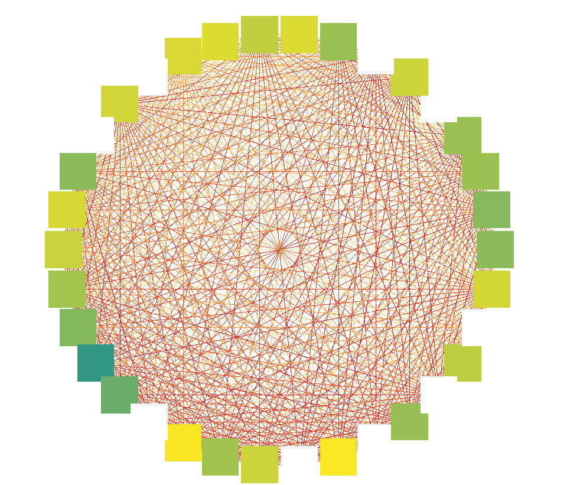

## Conclusões

O nosso objetivo inicial era criar visualizações para apontar possíveis correlações entre características de um país (políticas públicas e dados socioeconômicos) e o número de casos de DSTs, assim podemos dizer que cumprimos parcialmente os objetivos iniciais do nosso projeto, visto que conseguimos criar visualizações relacionando dados socioeconômicos e políticas públicas com o número de infecções por HIV, porém conseguimos apontar apenas para a HIV dentre todas as DSTs já conhecidas. Tínhamos pensado inicialmente que estudar um país à parte (no caso o Reino Unido) poderia ser suficiente, porém durante a execução dos estágios finais do projeto, observamos que poderia ser não suficiente devido à escassez de informações pertinentes sobre o assunto nas políticas públicas e também em encontrar fontes confiáveis para encontrar históricos dos parâmetros socioeconômicos.

Expandimos mais o nosso conhecimento sobre o poder de análises de bancos de dados não relacionais, especialmente o de grafos. Durante o projeto, vimos a possibilidade de explorar os grafos com algoritmos mais complexos de análise, especialmente o Louvain e o PageRank, para encontrar novas informações acerca da rede. Também aprendemos sobre o poder de ferramentas de visualização como o Cytoscape para ilustrar o banco de dados de grafos, sendo que de outra maneira seria muito mais complexo e difícil de entender.

Por fim, outro aprendizado importante foi encontrar maneiras de lidar com problemas recorrentes de falta de dados ou até partes quebradas dentro do banco de dados (como foi o caso do DBpedia, onde páginas de alguns países ou não tinham algumas informações que queríamos - nesse caso adicionamos apenas um null dentro do csv - ou quando a página no formato JSON estava quebrado - nesse caso, alguns países foram resolvidos ao tentar realizar as queries em XML).

Portanto conseguimos cumprir em parte os objetivos finais, já que tivemos que nos adaptar em relação à falta de dados para expandir o estudo além do caso de HIV no mundo, e também apresentamos sinais de progresso em relação ao uso dos recursos disponíveis como a DBpedia e de ferramentas, como o SQL e o Cytoscape, e também na capacidade de gerir problemas frequentes ao trabalhar com bancos de dados, como a falta de informações (ausência) e estruturas inconsistentes (que é permitida em modelos mais flexíveis como o JSON e grafos).

## Modelo Conceitual Final

### Modelo conceitual para os dados de infecções por HIV no mundo

## Modelos Lógicos Finais

### Modelo Lógico Relacional

Nas tabelas Testagem, Tratamento, Prevenção e Legislação, muitas colunas foram omitidas devido à sua quantidade.

### Modelo Lógico de Grafos

## Programa de extração e conversão de dados atualizado

Os notebooks de extração e tratamento de dados podem ser verificados na [pasta](notebook/tratamento-dados/) e os dados de saída se encontram em [processed](data/processed). Os arquivos ODS obtidos na base de dados UK Gov Statistics – referentes aos casos de DSTs no Reino Unido – e o arquivo csv da UNAIDS Laws and Policies – referentes aos dados de medidas públicas – encontram se na pasta [external](data/external). Esses dados foram tratados e filtrados, respectivamente em [uk_data.ipynb](notebook/tratamento-dados/uk_data.ipynb) e [getPoliciesData.ipynb](notebook/tratamento-dados/getPoliciesData.ipynb). Os dados socioeconômicos de cada país, retirados da DBPedia em formato de grafos, foram extraídos em [getCountryData.ipynb](notebook/tratamento-dados/getCountryData.ipynb), e os dados de infecções em JSON foram extraídos pelo uso da API Athena em [newInfectionsWHO.ipynb](notebook/tratamento-dados/newInfectionsWHO.ipynb).

Na etapa 4, utilizou-se mais um notebook para tratar dados. Os dados tratados são referentes a países vizinhos e pode ser visualizado em [CountriesNeighbourhood.csv](data/external/CountriesNeighbourhood.csv), o notebook utilizado foi [countryNeighbours.ipynb](notebook/tratamento-dados/countryNeighbours.ipynb) e a tabela resultante é [neighbours.csv](data/processed/neighbours.csv).

## Conjunto de queries para todos os modelos

* **Estágio 3 (Modelo Relacional)**
  
  As queries podem ser vistas na [pasta de queries](notebook/sql) e seus resultados foram convertidos em arquivos csv para simplificar a visualização e se encontram na pasta [saida](saida/). Especificamente no *estágio 3*, o notebook [PoliticasxRenda.ipynb](notebook/sql/PoliticasxRenda.ipynb) faz uma query que relaciona o número de políticas públicas por classificação de renda, cujo resultado pode ser visto no arquivo [politicas-x-renda.csv](saida/politicas-x-renda.csv). O notebook [RegiaoxInfeccoes.ipynb](notebook/sql/RegiaoxInfeccoes.ipynb) faz uma query que relaciona o número de infecções de HIV em cada região a cada ano, como pode ser visto em [regiao-x-infeccoes.csv](saida/regiao-x-infeccoes.csv), e o notebook [RendaxInfeccoes.ipynb](notebook/sql/RendaxInfeccoes.ipynb) relaciona o número de infecções com dados socioeconômicos dos países, como mostrado em [socioeconomico-x-infeccoes.csv](saida/socioeconomico-x-infeccoes.csv). Por fim, o notebook [policies-query.ipynb](notebook/sql/policies-query.ipynb) faz relações entre o número de camisinhas distribuídas por habitante e as políticas associadas a camisinhas de cada país, a porcentagem de países de cada região que têm ou não políticas de distribuição de camisinhas, a porcentagem de países em cada região que tem políticas nacionais de combate à AIDS e a porcentagem de países por categoria de renda que permitem o início do tratamento antirretroviral no dia do diagnóstico de HIV, respectivamente, em [numero-de-camisinhas-politicas.csv][saida/numero-de-camisinhas-politicas.csv], [distribuicao-regiao.csv](saida/distribuicao-regiao.csv), [estrategia-regiao.csv](saida/estrategia-regiao.csv) e [tratamento-classificacao.csv](saida/tratamento-classificacao.csv).

* **Estágio 4 (Modelo de grafos)**
  
  Já no estágio 4, realizamos queries para o modelo lógico de grafos utilizando o *Neo4j* e essas queries estão na pasta [src](src). Na query [clustering_socioeconomics.md](src/clustering_socioeconomics.md), busca-se encontrar maneiras de agrupar diferentes países com características socioeconômicas (Gini, IDH e PIB per Capita PPC) semelhantes entre si para depois linkar diferentes grupos e tentar correlacionar a quantidade de infecções através desses dados. Para isso, ligamos países (vértices) com valor socioeconômico semelhante com arestas, cujas arestas têm peso maior conforme mais próximo são os valores, e esse grafo foi processado através de uma biblioteca com Louvain considerando ou não os pesos das arestas. As saídas foram convertidas em csv e depois os resultados foram processados no Cytoscape para a visualização, onde quanto maior o tamanho do vértice maior será o IDH do país e cores diferenciam diferentes grupos, lembrando que as cores escolhidas não tem uma lógica por trás, por exemplo a escolha por uma cor mais escura não quer dizer que um grupo é pior ou melhor que outro. As saídas são:
  * Grafo com arestas ligando países com IDH parecidos e classificando países através do Gini e IDH considerando o peso entre arestas [rel_idh_class_gini_idh_peso.png](./assets/rel_idh_class_gini_idh_peso.png);
  * Grafo com arestas ligando países com Gini parecidos e classificando países através do Gini e IDH considerando o peso entre arestas [rel_gini_class_gini_idh_peso.png](./assets/rel_gini_class_gini_idh_peso.png);
  * Grafo com arestas ligando países com IDH parecidos e classificando países através do Gini, do IDH e do PIB per Capita PPC considerando o peso entre arestas [rel_idh_class_tudo_peso.png](./assets/rel_idh_class_tudo_peso.png);
  * Grafo com arestas ligando países com Gini parecidos e classificando países através do Gini, do IDH e do PIB per Capita PPC considerando o peso entre arestas [rel_gini_class_tudo_peso.png](./assets/rel_gini_class_tudo_peso.png);
  * Grafo com arestas ligando países com IDH parecidos e classificando países do PIB e da desigualdade econômica (Gini) desconsiderando o peso entre arestas [rel_idh_class_money_peso.png](./assets/rel_idh_class_money_peso.png);
  * Grafo com arestas ligando países com Gini parecidos e classificando países do PIB e da desigualdade econômica (Gini) desconsiderando o peso entre arestas [rel_gini_class_money_peso.png](./assets/rel_gini_class_money_peso.png).

  [Outra query](src/Politicas-Paises.md) tenta agrupar países cujas políticas públicas sejam semelhantes adicionando arestas entre dois países cujo peso é proporcional ao número de leis compartilhadas, assim o objetivo é tentar encontrar e correlacionar padrões na quantidade de políticas semelhantes com as características socioeconômicas do país. Primeiramente, são ligados todos os países pela quantidade de políticas que compartilham. Os vértices são agrupados conforme sua classe socioeconômica, como mostra a [imagem](./assets/total.png), sendo os nos cantos superior esquerdo, superior direito, inferior esquerdo e inferior direito países de renda alta, de renda baixa-média, renda baixa e média-alta, respectivamente. Devido à quantidade de vértices, não foi possível capturar os nomes dos países nas imagens. No gráfico, os vértices com coloração mais arroxeada têm IDH mais elevado, e arestas mais avermelhadas representam maior número de políticas coincidentes.
  Nota-se que os países com renda mais alta compartilham relativamente poucas políticas com países de outros grupos, como evidenciado pela cor clara de suas arestas. Além disso, há poucos países do grupo que têm muitas políticas iguais, o que pode ser visto pelas poucas arestas vermelhas na [imagem](./assets/highincome.png). Por outro lado, nota-se uma grande coincidência de políticas entre países de rendas baixa e baixa-média, e um grande número de países de baixa renda com políticas semelhantes, como pode ser visto em [lowincome.png](./assets/lowincome.png).

  Por fim, a [última query](src/regional_infections.md) cria um grafo ligando um país A com todos os países X tal que A e X compartilham fronteira (são países vizinhos). Criando essa fronteira, é possível analisar como os casos de infecção por HIV se distribuem geograficamente, permitindo buscar por regiões que apresentam grande número de casos. Algumas partes interessantes do grafo (OBS: países que não possuem dados de infecções no ano de 2015 estão com o nome em vermelho):
  * [África](assets/regional_infections_AFR.png);
  * [Ásia](assets/regional_infections_ASIApng.png);
  * [América do Sul](assets/regional_infections_SA.png).

## Bases de Dados

| Título da base           | Link                                            | Breve descrição                                                                                                 |
| ------------------------ | ----------------------------------------------- | --------------------------------------------------------------------------------------------------------------- |
| <s>AtlasPlus CDC</s>     | ~~https://www.cdc.gov/nchhstp/atlas/index.htm~~ | ~~Tabela com dados sobre DSTs nos EUA~~                                                                         |
| WHO GHO                  | https://apps.who.int/gho/athena/api/GHO         | Infecções por HIV no mundo e também informações algumas informações dos países como a região e línguas oficiais |
| <s>UK Gov Statistics</s> | ~~https://www.gov.uk/government/statistics/~~   | ~~Tabelas e textos sobre casos de DSTs no Reino Unido e medidas públicas~~                                      |
| UNAIDS Laws and Policies | https://lawsandpolicies.unaids.org              | Dados sobre medidas públicas adotadas em cada país, inclusive sobre DSTs                                        |
| DBpedia                  | http://dbpedia.org/data/                        | Dados socioeconômicos de cada país, como o PIB per capita, Gini e o IDH                                         |

## Arquivos de Dados

| Nome do Arquivo                                                                 | Link                                                                                                   | Breve descrição                                                                                                                                                                                                     |
| ------------------------------------------------------------------------------- | ------------------------------------------------------------------------------------------------------ | ------------------------------------------------------------------------------------------------------------------------------------------------------------------------------------------------------------------- |
| ~~`2019_Table_1_New_STI_diagnoses_and_rates_in_England_by_gender.ods`~~         | ~~[arquivo](data/external/2019_Table_1_New_STI_diagnoses_and_rates_in_England_by_gender.ods)~~         | ~~Novos casos de DSTs na Inglaterra por gênero (2010-2019 Uk Gov Statistics)~~                                                                                                                                      |
| ~~`2019_Table_4_All_STI_diagnoses_and_services_by_gender_and_sexual_risk.ods`~~ | ~~[arquivo](data/external/2019_Table_4_All_STI_diagnoses_and_services_by_gender_and_sexual_risk.ods)~~ | ~~Novos casos de DSTs na Inglaterra por gênero e risco sexual, com divisões em regiões (2015-2019 Uk Gov Statistics)~~                                                                                              |
| `NCPI downloads.csv`                                                            | [arquivo](data/external/NCPI%20downloads.csv)                                                          | Tabela de Leis e Políticas adotadas por países com relação ao HIV (UNAIDS)                                                                                                                                          |
| `CountriesNeighbourhood.csv`                                                    | [arquivo](data/external/CountriesNeighbourhood.csv)                                                    | Grafo em formato CSV que liga países que são vizinhos entre si.                                                                                                                                                     |
| `countries.csv`                                                                 | [arquivo](data/processed/countries.csv)                                                                | Tabela com os dados dos países já processados (DBPedia + WHO GHO)                                                                                                                                                   |
| `country_policies.csv`                                                          | [arquivo](data/processed/country_policies.csv)                                                         | Tabela com as políticas em cada país e seus respectivos valores (UNAIDS)                                                                                                                                            |
| `neighbours.csv`                                                                | [arquivo](data/processed/neighbours.csv)                                                               | Grafo em formato CSV que liga países que são vizinhos entre si filtrado e tratado de maneira que os países são referenciados utilizando as labels como chave estrangeira para a tabela de países (`countries.csv`). |
| `infections.csv`                                                                | [arquivo](data/processed/infections.csv)                                                               | Tabela com número de novas infecções por HIV em cada país (WHO GHO)                                                                                                                                                 |
| `legislacao.csv`                                                                | [arquivo](data/processed/legislacao.csv)                                                               | Tabela com legislações relacionadas ao HIV por país (UNAIDS)                                                                                                                                                        |
| `policies.csv`                                                                  | [arquivo](data/processed/policies.csv)                                                                 | Tabela com as políticas e seus respectivos tipos (UNAIDS)                                                                                                                                                           |
| `prevencao.csv`                                                                 | [arquivo](data/processed/prevencao.csv)                                                                | Tabela com políticas de prevenção do HIV por país (UNAIDS)                                                                                                                                                          |
| `testagem.csv`                                                                  | [arquivo](data/processed/testagem.csv)                                                                 | Tabela com políticas de testagem do HIV por país (UNAIDS)                                                                                                                                                           |
| `tratamento.csv`                                                                | [arquivo](data/processed/tratamento.csv)                                                               | Tabela com políticas de tratamento do HIV por país (UNAIDS)                                                                                                                                                         |
| ~~`uk_sti_cases_per_100000.csv`~~                                               | ~~[arquivo](data/processed/uk_sti_cases_per_100000.csv)~~                                              | ~~Casos de DSTs no Reino Unido por 100000 habitantes (Uk Gov Statistics)~~                                                                                                                                          |
| ~~`uk_sti_cases.csv`~~                                                          | ~~[arquivo](data/processed/uk_sti_cases.csv)~~                                                         | ~~Casos de DSTs no Reino Unido (Uk Gov Statistics)~~                                                                                                                                                                |
| `Number of new HIV infections`                                                  | [link](https://apps.who.int/gho/athena/api/GHO/HIV_0000000026?format=json)                             | Novos casos de infecção por HIV (WHO GHO)                                                                                                                                                                           |
