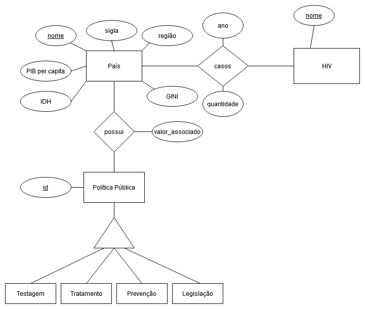
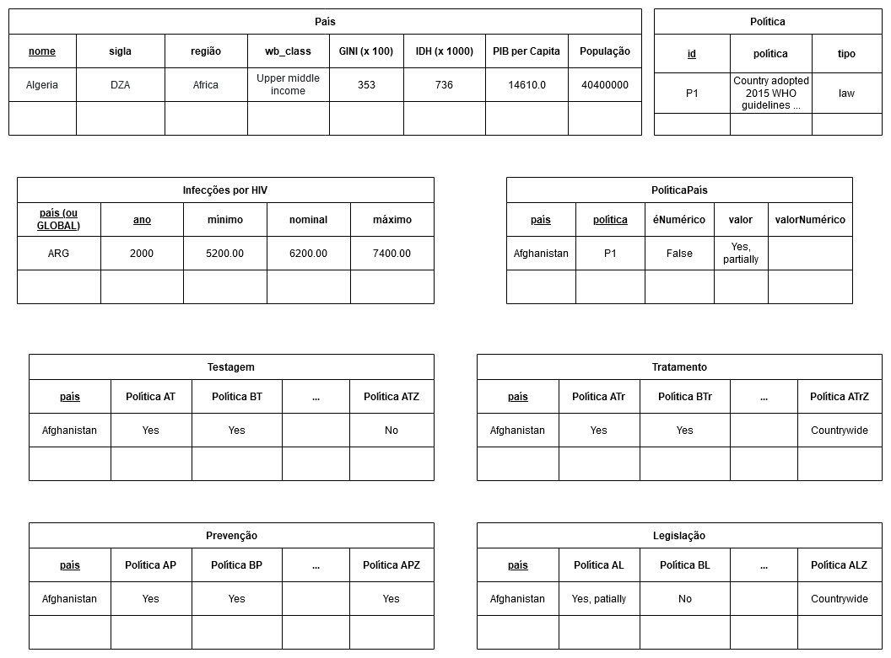
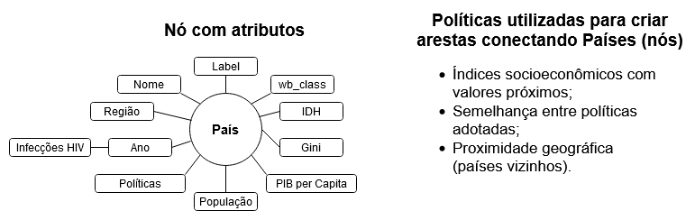

# Etapa Final

## Projeto `<Título do Projeto>`

## Equipe Cavaleiros da Query Estruturada

* Willian Takayuki Ozako - 207267

* Frederico Meletti Rappa - 216047

* João Alberto Moreira Seródio - 218548

## Slides da Apresentação da Etapa Final

Os slides da estapa podem ser vistos em [slides](./slides/etapa-final.pdf).

## Resumo do Projeto
> Texto resumindo o projeto.

## Motivação e Contexto

Visualizar possíveis correlações entre o número de casos de DSTs, aspectos socioeconômicos e políticas públicas, a fim de determinar fatores chave no controle de novos casos.

## Detalhamento do Projeto

Na query [RendaxInfecções](notebook/sql/RendaxInfeccoes.ipynb), a ideia era de criar um registro de casos de infecções de HIV em função do país (em sigla) em um determinado ano e sabendo dos dados socioeconômicos (PIB per Capita PPC, Gini* e IDH), com o Gini modificado, já que tanto para o IDH e para o PIB temos que quanto maior o valor melhor é o país, porém o Gini em sua definição é pior a medida que seu valor aumenta, então para condizer com os demais dados modificamos ao calcular (1-Gini). Nessa query todos os valores socioeconômicos foram normalizados através da fórmula (valor - mínimo) / (máximo - mínimo) como pode ver no código abaixo, sendo que os valores máximos e mínimos são encontrados no conjunto de todos os países.

~~~sql
CREATE VIEW socioeconomicoXinfeccoes AS
SELECT T.ano, T.sigla,
       (1.0 - T.gini - PNPG.minConvGini)/(PNPG.maxConvGini - PNPG.minConvGini) Corr_Gini,
       CAST(T.pibpercapita - PNPG.minpib AS DOUBLE) / CAST(PNPG.maxpib - PNPG.minpib AS DOUBLE) Norm_PIB,
       (T.taxaInfeccoes - PNI.minInf)/(PNI.maxInf-PNI.minInf) Norm_infeccoes,
       (T.IDH - PNPG.minIDH) / (PNPG.maxIDH - PNPG.minIDH) Norm_IDH
FROM tabelaInicial T, parNormInfeccoes PNI, parNormPibGini PNPG
WHERE T.ano = PNI.ano
ORDER BY ano, corr_gini, norm_pib
~~~ 

Na query [RegiãoxInfecções](notebook/sql/RegiaoxInfeccoes.ipynb) procuramos o total de infecções de HIV de uma certa região definida pela OMS (subcontinentes) em relação ao total de infecções no mundo em um dado ano.

~~~sql
CREATE VIEW RegiaoxInfeccoes AS
SELECT DP.ano, P.regiao, 
       CAST(SUM(DP.quantidade) AS DOUBLE) / CAST(SUM(DG.quantidade) AS DOUBLE)*100.0 Infeccoes
FROM Pais P, DST DP, DST DG
WHERE P.sigla = DP.regiao 
      AND DG.ano = DP.ano 
      AND DP.quantidade IS NOT NULL
GROUP BY P.regiao, DP.ano
ORDER BY DP.ano,
         P.regiao;

SELECT * FROM RegiaoxInfeccoes;
~~~ 

Em [GrupoXInfecção](notebook/sql/gruposXinfeccao.ipynb), buscamos apontar características de cada grupo (sendo que essa classificação foi resultado da aplicação de Louvain em um grafo que liga países com Gini e IDH parecidos e considerando o peso das arestas nessa clusterização) através dos valores médios de IDH e do Gini, lembrando que tivemos o cuidado de selecionar apenas grupos com pelo menos 2 membros, pois um grupo de um único país significa que provavelmente não conseguimos retirar dados desse país para agrupá-lo com outros países.

~~~sql 
CREATE VIEW GrupoXinfeccao AS
SELECT G.id id, count(*) number_of_countries, 
       AVG(P.idh) idh, AVG(P.gini) gini,
       sum(I.qtde) qtde_infeccoes
FROM Pais AS P, Grupo AS G, Infeccoes AS I
WHERE P.sigla = I.regiao AND P.nome = G.pais AND I.ano=2014
GROUP BY G.id
HAVING number_of_countries > 1
ORDER BY idh, gini desc;
~~~

Em [clustering_socioeconomics](src/clustering_socioeconomics.md), tentamos contruir grafos onde os países são vértices e arestas conectam países cujos valores de um dado socioeconômico têm diferença menor que um MAX e o peso dessa aresta era então (MAX-diferença). Assim, aplicando Louvain nesse grafo para diferentes combinações de tipos de arestas (PIB, IDH ou Gini) e considerando peso ou não, analisamos os resultados finais e concluímos que o a combinação de arestas de Gini combinadas com o de IDH e considerando o peso das arestas levou a um resultado mais satisfatório. No seguinte recorte, vemos a criação de uma aresta conectando dois países com valores de Gini próximos com o MAX=10.

~~~cypher
MATCH (a: Country)
MATCH (b: Country)
WHERE a.name < b.name AND a.gini IS NOT NULL AND b.gini IS NOT NULL AND abs(toInteger(a.gini) - toInteger(b.gini)) < 10
CREATE (a)-[i:Inequality]->(b)
SET i.weight = 10 - abs(toInteger(a.gini) - toInteger(b.gini))
~~~

> Apresente aqui detalhes da análise. Nesta seção ou na seção de Resultados podem aparecer destaques de código como indicado a seguir. Note que foi usada uma técnica de highlight de código, que envolve colocar o nome da linguagem na abertura de um trecho com `~~~`, tal como `~~~python`.
> Os destaques de código devem ser trechos pequenos de poucas linhas, que estejam diretamente ligados a alguma explicação. Não utilize trechos extensos de código. Se algum código funcionar online (tal como um Jupyter Notebook), aqui pode haver links. No caso do Jupyter, preferencialmente para o Binder abrindo diretamente o notebook em questão.

~~~python
df = pd.read_excel("/content/drive/My Drive/Colab Notebooks/dataset.xlsx");
sns.set(color_codes=True);
sns.distplot(df.Hemoglobin);
plt.show();
~~~

## Evolução do Projeto
Durante a realização das primeiras fases do projeto, houve dificuldades em encontrar os datasets necessários para a análise de DST em contexto global, já que encontramos poucos dados referentes às diferentes doenças sexualmente transmissíveis e a grande maioria era focada no HIV/Aids, e encontramos apenas dados sobre DSTs em geral do Reino Unido e dos EUA, ou seja, insuficientes para a nossa análise no contexto mundial e assim concluímos que seria melhor realizar análise sobre HIV no mundo e DSTs no Reino Unido. Também que fonte e como utilizaríamos os dados a partir de um grafo não ficou bem definido e, como apontado pelo professor, descobrir que tipo de agente causador da DST (vírus, bactéria ou fungo) poderia ser realizada manualmente ao invés de criar um programa de extração dessas informações no site da *DBpedia*.

Na fase 3, programamos as primeiras versões de extração e tratamentos de dados em Python para serem utilizadas nas demais fases do projeto. Em relação ao uso de um banco de dados de grafos, chegamos a conclusão de que seria melhor continuar com a *DBpedia*, porém ao invés de extrair informações de doenças, seria melhor extrair dados socioeconômicos dos países, visto que esse trabalho seria trabalhoso demais (eram 170 países para serem pesquisados) e também convergia para um dos objetivos finais (vizualizar correlações entre dados socioeconômicos e casos de DSTs). A primeira dificuldade que enfrentamos foi que muitas páginas em JSON da DBpedia estavam "quebradas", provavelmente porque têm símbolos não compatíveis com esse formato, e mesmo realizando a extração por meio do formato XML não houve uma melhora significativa, além de que muitos países não forneciam alguns dados (como o Gini). Outro problema foi como utilizar os dados sobre políticas públicas extraídos da UNAIDS, já que era uma tabela muito grande e foi parcialmente resolvido ao dividir a tabela em quatro, cada um tratando de um dos temas: "testagem", "tratamento", "prevenção" e "legislação". Ainda não tínhamos certeza se utilizaríamos os dados do Reino Unido, já que seria necessário reescrever tudo à mão no formato csv.

Ainda durante a fase 3, agora na parte de realizar queries no modelo relacional, o maior problema foi definir que tipos análises poderiam ser feitas nos dados sobre legislações, visto que como os dados eram não numéricos (assim era mais difícil de propor alguma análise como foi o caso de dados socioeconômicos VS infecções) e não seguiam um padrão bem definido de respostas como "sim", "não", "parcialmente" e, para contornar esse problema, tivemos que substituir as respostas dos campos por respostas mais simples como "sim" e "não".

Na fase 4, tivemos o foco sobre queries em grafos e maior dificuldade foi definir o que seria feito com o grafo e que objetivos deveriam ser cumpridos nessa etapa, pois o pensamento do grupo estava todo direcionado em modelos relacionais e, no fim, pensamos em tentar utilizar algoritmos de agrupamento como o Louvain para tentar classificar diferentes países de acordo com similaridades dos dados socioeconômicos e políticas públicas similares. Também houve dificuldade em encontrar um algoritmo que classificasse países de acordo com a aproximidade entre dois países (de acordo com dados socioeconômicos) e, por fim, adaptamos o peso das arestas para que quanto mais próximos os valores, maior seria o nó. Outro problema foi devido à instalação e o uso do Cytoscape, pois a interface não permite (até aonde se sabe) de importar os nós e depois importar as arestas com outra tabela, assim fomos obrigados a criar uma tabela com todos os valores necessários (nós e arestas) para ser importada no Cytoscape. 

Na fase final, concluímos que não valeria a pena tentar analizar os dados sobre o Reino Unido, visto que os dados deveriam ser escritos manualmente e também os dados eram pequenos (basicamente era um relatório pronto do governo do Reino Unido). Assim os modelos lógicos e conceituais do Reino Unido foram descartados. Por recomendação do professor, também adicionamos um grafo que ligava países que compartilhavam fronteiras para ver se haveria uma possível relação entre o número de casos de DSTs de um país e de seus vizinhos.

> Relatório de evolução, descrevendo as evoluções na modelagem do projeto, dificuldades enfrentadas, mudanças de rumo, melhorias e lições aprendidas. Referências aos diagramas, modelos e recortes de mudanças são bem-vindos.
> Podem ser apresentados destaques na evolução dos modelos conceitual e lógico. O modelo inicial e intermediários (quando relevantes) e explicação de refinamentos, mudanças ou evolução do projeto que fundamentaram as decisões.
> Relatar o processo para se alcançar os resultados é tão importante quanto os resultados.

## Resultados e Discussão
> Apresente os resultados da forma mais rica possível, com gráficos e tabelas. Mesmo que o seu código rode online em um notebook, copie para esta parte a figura estática. A referência a código e links para execução online pode ser feita aqui ou na seção de detalhamento do projeto (o que for mais pertinente).
> A discussão dos resultados também pode ser feita aqui na medida em que os resultados são apresentados ou em seção independente. Aspectos importantes a serem discutidos: É possível tirar conclusões dos resultados? Quais? Há indicações de direções para estudo? São necessários trabalhos mais profundos?

## Conclusões
> Apresente aqui as conclusões finais do trabalho e as lições aprendidas.

## Modelo Conceitual Final

### Modelo conceitual para os dados de infecções por HIV no mundo

### Modelo conceitual para infecções de DSTs no Reino Unido (descartado)

## Modelos Lógicos Finais

### Modelo Lógico Relacional

Nas tabelas Testagem, Tratamento, Prevenção e Legislação, muitas colunas foram omitidas devido à sua quantidade.

### Modelo Lógico de Grafos

## Programa de extração e conversão de dados atualizado

Os notebooks de extração e tratamento de dados pode ser verificados na [pasta](notebook/tratamento-dados/) e os dados de saída se encontram em [processed](data/processed). Os arquivos ODS obtidos na base de dados UK Gov Statistics – referentes aos casos de DSTs no Reino Unido – e o arquivo csv da UNAIDS Laws and Policies – referentes aos dados de medidas públicas – encontram se na pasta [external](data/external). Esses dados foram tratados e filtrados, respectivamente em [uk_data.ipynb](notebook/tratamento-dados/uk_data.ipynb) e [getPoliciesData.ipynb](notebook/tratamento-dados/getPoliciesData.ipynb). Os dados socioeconômicos de cada país, retirados da DBPedia em formato de grafos, foram extraídos em [getCountryData.ipynb](notebook/tratamento-dados/getCountryData.ipynb), e os dados de infecções em JSON foram extraídos pelo uso da API Athena em [newInfectionsWHO.ipynb](notebook/tratamento-dados/newInfectionsWHO.ipynb).

Na estap 4, utilizou-se mais um notebook para tratar dados. Os dados tratados são referentes a países vizinhos e pode ser visualizado em [CountriesNeighbourhood.csv](data/external/CountriesNeighbourhood.csv), o notebook utilizado foi [countryNeighbours.ipynb](notebook/tratamento-dados/countryNeighbours.ipynb) e a tabela resultante é [neighbours.csv](data/processed/neighbours.csv).

## Conjunto de queries para todos os modelos

* **Estágio 3 (Modelo Relacional)**
  
  As queries podem ser vistas na [pasta de queries](notebook/sql) e seus resultados foram convertidos em arquivos csv para simplificar a visualização e se encontram na pasta [saida](saida/). Especificamente no *estágio 3*, o notebook [PoliticasxRenda.ipynb](notebook/sql/PoliticasxRenda.ipynb) faz uma query que relaciona o número de políticas públicas por classificação de renda, cujo resultado pode ser visto no arquivo [politicas-x-renda.csv](saida/politicas-x-renda.csv). O notebook [RegiaoxInfeccoes.ipynb](notebook/sql/RegiaoxInfeccoes.ipynb) faz uma query que relaciona o número de infecções de HIV em cada região a cada ano, como pode ser visto em [regiao-x-infeccoes.csv](saida/regiao-x-infeccoes.csv), e o notebook [RendaxInfeccoes.ipynb](notebook/sql/RendaxInfeccoes.ipynb) relaciona o número de infecções com dados socioeconômicos dos países, como mostrado em [socioeconomico-x-infeccoes.csv](saida/socioeconomico-x-infeccoes.csv). Por fim, o notebook [policies-query.ipynb](notebook/sql/policies-query.ipynb) faz relações entre o número de camisinhas distribuídas por habitante e as políticas associadas a camisinhas de cada país, a porcentagem de países de cada região que têm ou não políticas de distribuição de camisinhas, a porcentagem de países em cada região que tem políticas nacionais de combate à AIDS e a porcentagem de países por categoria de renda que permitem o início do tratamento antirretroviral no dia do diagnóstico de HIV, respectivamente, em [numero-de-camisinhas-politicas.csv][saida/numero-de-camisinhas-politicas.csv], [distribuicao-regiao.csv](saida/distribuicao-regiao.csv), [estrategia-regiao.csv](saida/estrategia-regiao.csv) e [tratamento-classificacao.csv](saida/tratamento-classificacao.csv).

* **Estágio 4 (Modelo de grafos)**
  
  Já no estágio 4, realizamos queries para o modelo lógico de grafos utilizando o *Neo4j* e essas queries estão na pasta [src](src). Na query [clustering_socioeconomics.md](src/clustering_socioeconomics.md), busca-se encontrar maneiras de agrupar diferentes países com características socioeconômicas (Gini, IDH e PIB per Capita PPC) semelhantes entre si para depois linkar diferentes grupos e tentar correlacionar a quantidade de infecções através desses dados. Para isso, ligamos países (vértices) com valor socioeconômico semelhante com arestas, cujas arestas têm peso maior conforme mais próximo são os valores, e esse grafo foi processado através de uma biblioteca com Louvain considerando ou não os pesos das arestas. As saídas foram convertidas em csv e depois os resultados foram processados no Cytoscape para a visualização, onde quanto maior o tamanho do vértice maior será o IDH do país e cores diferenciam diferentes grupos, lembrando que as cores escolhidas não tem uma lógica por trás, por exemplo a escolha por uma cor mais escura não quer dizer que um grupo é pior ou melhor que outro. As saídas são:
  * Grafo com arestas ligando países com IDH parecidos e classificando países através do Gini e IDH considerando o peso entre arestas [rel_idh_class_gini_idh_peso.png](./assets/rel_idh_class_gini_idh_peso.png);
  * Grafo com arestas ligando países com Gini parecidos e classificando países através do Gini e IDH considerando o peso entre arestas [rel_gini_class_gini_idh_peso.png](./assets/rel_gini_class_gini_idh_peso.png);
  * Grafo com arestas ligando países com IDH parecidos e classificando países através do Gini, do IDH e do PIB per Capita PPC considerando o peso entre arestas [rel_idh_class_tudo_peso.png](./assets/rel_idh_class_tudo_peso.png);
  * Grafo com arestas ligando países com Gini parecidos e classificando países através do Gini, do IDH e do PIB per Capita PPC considerando o peso entre arestas [rel_gini_class_tudo_peso.png](./assets/rel_gini_class_tudo_peso.png);
  * Grafo com arestas ligando países com IDH parecidos e classificando países do PIB e da desigualdade econômica (Gini) desconsiderando o peso entre arestas [rel_idh_class_money_peso.png](./assets/rel_idh_class_money_peso.png);
  * Grafo com arestas ligando países com Gini parecidos e classificando países do PIB e da desigualdade econômica (Gini) desconsiderando o peso entre arestas [rel_gini_class_money_peso.png](./assets/rel_gini_class_money_peso.png).

  Outra query tenta agrupar países cujas políticas públicas sejam semelhantes adicionando arestas entre dois países cujo peso é proporcional ao número de leis compartilhadas, assim o objetivo é tentar encontrar e correlacionar padrões na quantidade de políticas semelhantes com as características socioeconômicas do país. Primeiramente, são ligados todos os países pela quantidade de políticas que compartilha. Os vértices são agrupados conforme sua classe socioeconômica, como mostra a [imagem](./assets/total.png), sendo os nos cantos superior esquerdo, superior direito, inferior esquerdo e inferior direito países de renda alta, de renda baixa-média, renda baixa e média-alta, respectivamente. Devido à quantidade de vértices, não foi possível capturar os nomes dos países nas imagens. No gráfico, os vértices com coloração mais arroxeada têm IDH mais elevado, e arestas mais avermelhadas representam maior número de políticas coincidentes.
  Nota-se que os países com renda mais alta compartilham relativamente poucas políticas com países de outros grupos, como evidenciado pela cor clara de suas arestas. Além disso, há poucos países do grupo que têm muitas políticas iguais, o que pode ser visto pelas poucas arestas vermelhas na [imagem](./assets/highincome.png). Por outro lado, nota-se uma grande coincidência de políticas entre países de rendas baixa e baixa-média, e um grande número de países de baixa renda com políticas semelhantes, como pode ser visto em [lowincome.png](./assets/lowincome.png).

  Por fim, a última query cria um grafo ligando um país A com todos os países X tal que A e X compartilham fronteira (são países vizinhos). Criando essa fronteira, é possível analisar como os casos de infecção por HIV se distribuem geograficamente, permitindo buscar por regiões que apresentam grande número de casos. Algumas partes interessantes do grafo (OBS: países que não possuem dados de infecções no ano de 2015 estão com o nome em vermelho):
  * [África](assets/regional_infections_AFR.png);
  * [Ásia](assets/regional_infections_ASIApng.png);
  * [América do Sul](assets/regional_infections_SA.png).

## Bases de Dados

| Título da base           | Link                                            | Breve descrição                                                                                                 |
| ------------------------ | ----------------------------------------------- | --------------------------------------------------------------------------------------------------------------- |
| <s>AtlasPlus CDC</s>     | ~~https://www.cdc.gov/nchhstp/atlas/index.htm~~ | ~~Tabela com dados sobre DSTs nos EUA~~                                                                         |
| WHO GHO                  | https://apps.who.int/gho/athena/api/GHO         | Infecções por HIV no mundo e também informações algumas informações dos países como a região e línguas oficiais |
| <s>UK Gov Statistics</s>        | ~~https://www.gov.uk/government/statistics/~~       | ~~Tabelas e textos sobre casos de DSTs no Reino Unido e medidas públicas~~                                          |
| UNAIDS Laws and Policies | https://lawsandpolicies.unaids.org              | Dados sobre medidas públicas adotadas em cada país, inclusive sobre DSTs                                        |
| DBpedia                  | http://dbpedia.org/data/                        | Dados socioeconômicos de cada país, como o PIB per capita, Gini e o IDH                                         |

## Arquivos de Dados
| Nome do Arquivo                                                             | Link                                                                                               | Breve descrição                                                                                                                                                                                                     |
 | --------------------------------------------------------------------------- | -------------------------------------------------------------------------------------------------- | ------------------------------------------------------------------------------------------------------------------------------------------------------------------------------------------------------------------- |
 | ~~`2019_Table_1_New_STI_diagnoses_and_rates_in_England_by_gender.ods`~~         | ~~[arquivo](data/external/2019_Table_1_New_STI_diagnoses_and_rates_in_England_by_gender.ods)~~         | ~~Novos casos de DSTs na Inglaterra por gênero (2010-2019 Uk Gov Statistics)~~                                                                                                                                          |
 | ~~`2019_Table_4_All_STI_diagnoses_and_services_by_gender_and_sexual_risk.ods`~~ | ~~[arquivo](data/external/2019_Table_4_All_STI_diagnoses_and_services_by_gender_and_sexual_risk.ods)~~ | ~~Novos casos de DSTs na Inglaterra por gênero e risco sexual, com divisões em regiões (2015-2019 Uk Gov Statistics)~~                                                                                                  |
 | `NCPI downloads.csv`                                                        | [arquivo](data/external/NCPI%20downloads.csv)                                                      | Tabela de Leis e Políticas adotadas por países com relação ao HIV (UNAIDS)                                                                                                                                          |
 | `CountriesNeighbourhood.csv`                                                | [arquivo](data/external/CountriesNeighbourhood.csv)                                                | Grafo em formato CSV que liga países que são vizinhos entre si.                                                                                                                                                     |
 | `countries.csv`                                                             | [arquivo](data/processed/countries.csv)                                                            | Tabela com os dados dos países já processados (DBPedia + WHO GHO)                                                                                                                                                   |
 | `country_policies.csv`                                                      | [arquivo](data/processed/country_policies.csv)                                                     | Tabela com as políticas em cada país e seus respectivos valores (UNAIDS)                                                                                                                                            |
 | `neighbours.csv`                                                            | [arquivo](data/processed/neighbours.csv)                                                           | Grafo em formato CSV que liga países que são vizinhos entre si filtrado e tratado de maneira que os países são referenciados utilizando as labels como chave estrangeira para a tabela de países (`countries.csv`). |
 | `infections.csv`                                                            | [arquivo](data/processed/infections.csv)                                                           | Tabela com número de novas infecções por HIV em cada país (WHO GHO)                                                                                                                                                 |
 | `legislacao.csv`                                                            | [arquivo](data/processed/legislacao.csv)                                                           | Tabela com legislações relacionadas ao HIV por país (UNAIDS)                                                                                                                                                        |
 | `policies.csv`                                                              | [arquivo](data/processed/policies.csv)                                                             | Tabela com as políticas e seus respectivos tipos (UNAIDS)                                                                                                                                                           |
 | `prevencao.csv`                                                             | [arquivo](data/processed/prevencao.csv)                                                            | Tabela com políticas de prevenção do HIV por país (UNAIDS)                                                                                                                                                          |
 | `testagem.csv`                                                              | [arquivo](data/processed/testagem.csv)                                                             | Tabela com políticas de testagem do HIV por país (UNAIDS)                                                                                                                                                           |
 | `tratamento.csv`                                                            | [arquivo](data/processed/tratamento.csv)                                                           | Tabela com políticas de tratamento do HIV por país (UNAIDS)                                                                                                                                                         |
 | ~~`uk_sti_cases_per_100000.csv`~~                                               | ~~[arquivo](data/processed/uk_sti_cases_per_100000.csv)~~                                              | ~~Casos de DSTs no Reino Unido por 100000 habitantes (Uk Gov Statistics)~~                                                                                                                                              |
 | ~~`uk_sti_cases.csv`~~                                                          | ~~[arquivo](data/processed/uk_sti_cases.csv)~~                                                         | ~~Casos de DSTs no Reino Unido (Uk Gov Statistics)~~                                                                                                                                                                    |
 | `Number of new HIV infections`                                              | [link](https://apps.who.int/gho/athena/api/GHO/HIV_0000000026?format=json)                         | Novos casos de infecção por HIV (WHO GHO)                                                                                                                                                                           |

# Versão velha!

# Etapa 05 - Entrega Final

## Slides da Apresentação da Etapa

Os slides da estapa podem ser vistos em [slides](./slides/etapa-final.pdf).

## Modelo Conceitual Atualizado

### Modelo conceitual para os dados de infecções por HIV no mundo

### Modelo conceitual para infecções de DSTs no Reino Unido (descartado)

## Modelos Lógicos Atualizados

### Modelo Lógico Relacional

Nas tabelas Testagem, Tratamento, Prevenção e Legislação, muitas colunas foram omitidas devido à sua quantidade.

### Modelo Lógico de Grafos

## Programa de extração e conversão de dados atualizado

Os notebooks de extração e tratamento de dados pode ser verificados na [pasta](notebook/tratamento-dados/) e os dados de saída se encontram em [processed](data/processed). Os arquivos ODS obtidos na base de dados UK Gov Statistics – referentes aos casos de DSTs no Reino Unido – e o arquivo csv da UNAIDS Laws and Policies – referentes aos dados de medidas públicas – encontram se na pasta [external](data/external). Esses dados foram tratados e filtrados, respectivamente em [uk_data.ipynb](notebook/tratamento-dados/uk_data.ipynb) e [getPoliciesData.ipynb](notebook/tratamento-dados/getPoliciesData.ipynb). Os dados socioeconômicos de cada país, retirados da DBPedia em formato de grafos, foram extraídos em [getCountryData.ipynb](notebook/tratamento-dados/getCountryData.ipynb), e os dados de infecções em JSON foram extraídos pelo uso da API Athena em [newInfectionsWHO.ipynb](notebook/tratamento-dados/newInfectionsWHO.ipynb).

Na estap 4, utilizou-se mais um notebook para tratar dados. Os dados tratados são referentes a países vizinhos e pode ser visualizado em [CountriesNeighbourhood.csv](data/external/CountriesNeighbourhood.csv), o notebook utilizado foi [countryNeighbours.ipynb](notebook/tratamento-dados/countryNeighbours.ipynb) e a tabela resultante é [neighbours.csv](data/processed/neighbours.csv).

## Conjunto de queries de dois modelos

* Estágio 3
  
  As queries podem ser vistas na [pasta de queries](notebook/sql) e seus resultados foram convertidos em arquivos csv para simplificar a visualização e se encontram na pasta [saida](saida/). Especificamente no *estágio 3*, o notebook [PoliticasxRenda.ipynb](notebook/sql/PoliticasxRenda.ipynb) faz uma query que relaciona o número de políticas públicas por classificação de renda, cujo resultado pode ser visto no arquivo [politicas-x-renda.csv](saida/politicas-x-renda.csv). O notebook [RegiaoxInfeccoes.ipynb](notebook/sql/RegiaoxInfeccoes.ipynb) faz uma query que relaciona o número de infecções de HIV em cada região a cada ano, como pode ser visto em [regiao-x-infeccoes.csv](saida/regiao-x-infeccoes.csv), e o notebook [RendaxInfeccoes.ipynb](notebook/sql/RendaxInfeccoes.ipynb) relaciona o número de infecções com dados socioeconômicos dos países, como mostrado em [socioeconomico-x-infeccoes.csv](saida/socioeconomico-x-infeccoes.csv). Por fim, o notebook [policies-query.ipynb](notebook/sql/policies-query.ipynb) faz relações entre o número de camisinhas distribuídas por habitante e as políticas associadas a camisinhas de cada país, a porcentagem de países de cada região que têm ou não políticas de distribuição de camisinhas, a porcentagem de países em cada região que tem políticas nacionais de combate à AIDS e a porcentagem de países por categoria de renda que permitem o início do tratamento antirretroviral no dia do diagnóstico de HIV, respectivamente, em [numero-de-camisinhas-politicas.csv][saida/numero-de-camisinhas-politicas.csv], [distribuicao-regiao.csv](saida/distribuicao-regiao.csv), [estrategia-regiao.csv](saida/estrategia-regiao.csv) e [tratamento-classificacao.csv](saida/tratamento-classificacao.csv).

* Estágio 4
  
  Já no estágio 4, realizamos queries para o modelo lógico de grafos utilizando o *Neo4j* e essas queries estão na pasta [src](src). Na query [clustering_socioeconomics.md](src/clustering_socioeconomics.md), busca-se encontrar maneiras de agrupar diferentes países com características socioeconômicas (Gini, IDH e PIB per Capita PPC) semelhantes entre si para depois linkar diferentes grupos e tentar correlacionar a quantidade de infecções através desses dados. Para isso, ligamos países (vértices) com valor socioeconômico semelhante com arestas, cujas arestas têm peso maior conforme mais próximo são os valores, e esse grafo foi processado através de uma biblioteca com Louvain considerando ou não os pesos das arestas. As saídas foram convertidas em csv e depois os resultados foram processados no Cytoscape para a visualização, onde quanto maior o tamanho do vértice maior será o IDH do país e cores diferenciam diferentes grupos, lembrando que as cores escolhidas não tem uma lógica por trás, por exemplo a escolha por uma cor mais escura não quer dizer que um grupo é pior ou melhor que outro. As saídas são:
  * Grafo com arestas ligando países com IDH parecidos e classificando países através do Gini e IDH considerando o peso entre arestas [rel_idh_class_gini_idh_peso.png](./assets/rel_idh_class_gini_idh_peso.png);
  * Grafo com arestas ligando países com Gini parecidos e classificando países através do Gini e IDH considerando o peso entre arestas [rel_gini_class_gini_idh_peso.png](./assets/rel_gini_class_gini_idh_peso.png);
  * Grafo com arestas ligando países com IDH parecidos e classificando países através do Gini, do IDH e do PIB per Capita PPC considerando o peso entre arestas [rel_idh_class_tudo_peso.png](./assets/rel_idh_class_tudo_peso.png);
  * Grafo com arestas ligando países com Gini parecidos e classificando países através do Gini, do IDH e do PIB per Capita PPC considerando o peso entre arestas [rel_gini_class_tudo_peso.png](./assets/rel_gini_class_tudo_peso.png);
  * Grafo com arestas ligando países com IDH parecidos e classificando países do PIB e da desigualdade econômica (Gini) desconsiderando o peso entre arestas [rel_idh_class_money_peso.png](./assets/rel_idh_class_money_peso.png);
  * Grafo com arestas ligando países com Gini parecidos e classificando países do PIB e da desigualdade econômica (Gini) desconsiderando o peso entre arestas [rel_gini_class_money_peso.png](./assets/rel_gini_class_money_peso.png).

  Outra query tenta agrupar países cujas políticas públicas sejam semelhantes adicionando arestas entre dois países cujo peso é proporcional ao número de leis compartilhadas, assim o objetivo é tentar encontrar e correlacionar padrões na quantidade de políticas semelhantes com as características socioeconômicas do país. Primeiramente, são ligados todos os países pela quantidade de políticas que compartilha. Os vértices são agrupados conforme sua classe socioeconômica, como mostra a [imagem](./assets/total.png), sendo os nos cantos superior esquerdo, superior direito, inferior esquerdo e inferior direito países de renda alta, de renda baixa-média, renda baixa e média-alta, respectivamente. Devido à quantidade de vértices, não foi possível capturar os nomes dos países nas imagens. No gráfico, os vértices com coloração mais arroxeada têm IDH mais elevado, e arestas mais avermelhadas representam maior número de políticas coincidentes.
  Nota-se que os países com renda mais alta compartilham relativamente poucas políticas com países de outros grupos, como evidenciado pela cor clara de suas arestas. Além disso, há poucos países do grupo que têm muitas políticas iguais, o que pode ser visto pelas poucas arestas vermelhas na [imagem](./assets/highincome.png). Por outro lado, nota-se uma grande coincidência de políticas entre países de rendas baixa e baixa-média, e um grande número de países de baixa renda com políticas semelhantes, como pode ser visto em [lowincome.png](./assets/lowincome.png).

  Por fim, a última query cria um grafo ligando um país A com todos os países X tal que A e X compartilham fronteira (são países vizinhos). Criando essa fronteira, é possível analisar como os casos de infecção por HIV se distribuem geograficamente, permitindo buscar por regiões que apresentam grande número de casos. Algumas partes interessantes do grafo (OBS: países que não possuem dados de infecções no ano de 2015 estão com o nome em vermelho):
  * [África](assets/regional_infections_AFR.png);
  * [Ásia](assets/regional_infections_ASIApng.png);
  * [América do Sul](assets/regional_infections_SA.png).
  
## Escolha do modelo de grafos

  As queries desenvolvidas nessa etapa objetivam, em geral, a visualização e análise da correlação entre políticas públicas, dados socioeconômicos e infecções. O modelo de grafos permite uma melhor diferenciação entre agrupamentos de países, e a possibilidade de, por exemplo, ajustar o tamanho de um nó de acordo com alguma característica permite mais facilmente sua comparação. Além disso, esse formato simplifica a visualização da relação entre dados, o que seria difícil na análise de uma tabela no modelo relacional, especialmente para grandes volumes de dados: o grafo de países e políticas públicas, por exemplo, precisaria ser representado por uma tabela de cerca de 28900 linhas, que tornaria a análise desejada inviável. A visualização das relações entre países por arestas de um grafo também simplifica muito certas análises, como as de dados socioeconômicos, e permite encontrar similaridades entre os dados antes não percebidas, como por exemplo cada uma das componentes conexas nos grafos de IDH.

## Bases de Dados

| Título da base           | Link                                            | Breve descrição                                                                                                 |
| ------------------------ | ----------------------------------------------- | --------------------------------------------------------------------------------------------------------------- |
| <s>AtlasPlus CDC</s>     | ~~https://www.cdc.gov/nchhstp/atlas/index.htm~~ | ~~Tabela com dados sobre DSTs nos EUA~~                                                                         |
| WHO GHO                  | https://apps.who.int/gho/athena/api/GHO         | Infecções por HIV no mundo e também informações algumas informações dos países como a região e línguas oficiais |
| <s>UK Gov Statistics</s>        | ~~https://www.gov.uk/government/statistics/~~       | ~~Tabelas e textos sobre casos de DSTs no Reino Unido e medidas públicas~~                                          |
| UNAIDS Laws and Policies | https://lawsandpolicies.unaids.org              | Dados sobre medidas públicas adotadas em cada país, inclusive sobre DSTs                                        |
| DBpedia                  | http://dbpedia.org/data/                        | Dados socioeconômicos de cada país, como o PIB per capita, Gini e o IDH                                         |

## Arquivos de Dados

 | Nome do Arquivo                                                             | Link                                                                                               | Breve descrição                                                                                                                                                                                                     |
 | --------------------------------------------------------------------------- | -------------------------------------------------------------------------------------------------- | ------------------------------------------------------------------------------------------------------------------------------------------------------------------------------------------------------------------- |
 | ~~`2019_Table_1_New_STI_diagnoses_and_rates_in_England_by_gender.ods`~~         | ~~[arquivo](data/external/2019_Table_1_New_STI_diagnoses_and_rates_in_England_by_gender.ods)~~         | ~~Novos casos de DSTs na Inglaterra por gênero (2010-2019 Uk Gov Statistics)~~                                                                                                                                          |
 | ~~`2019_Table_4_All_STI_diagnoses_and_services_by_gender_and_sexual_risk.ods`~~ | ~~[arquivo](data/external/2019_Table_4_All_STI_diagnoses_and_services_by_gender_and_sexual_risk.ods)~~ | ~~Novos casos de DSTs na Inglaterra por gênero e risco sexual, com divisões em regiões (2015-2019 Uk Gov Statistics)~~                                                                                                  |
 | `NCPI downloads.csv`                                                        | [arquivo](data/external/NCPI%20downloads.csv)                                                      | Tabela de Leis e Políticas adotadas por países com relação ao HIV (UNAIDS)                                                                                                                                          |
 | `CountriesNeighbourhood.csv`                                                | [arquivo](data/external/CountriesNeighbourhood.csv)                                                | Grafo em formato CSV que liga países que são vizinhos entre si.                                                                                                                                                     |
 | `countries.csv`                                                             | [arquivo](data/processed/countries.csv)                                                            | Tabela com os dados dos países já processados (DBPedia + WHO GHO)                                                                                                                                                   |
 | `country_policies.csv`                                                      | [arquivo](data/processed/country_policies.csv)                                                     | Tabela com as políticas em cada país e seus respectivos valores (UNAIDS)                                                                                                                                            |
 | `neighbours.csv`                                                            | [arquivo](data/processed/neighbours.csv)                                                           | Grafo em formato CSV que liga países que são vizinhos entre si filtrado e tratado de maneira que os países são referenciados utilizando as labels como chave estrangeira para a tabela de países (`countries.csv`). |
 | `infections.csv`                                                            | [arquivo](data/processed/infections.csv)                                                           | Tabela com número de novas infecções por HIV em cada país (WHO GHO)                                                                                                                                                 |
 | `legislacao.csv`                                                            | [arquivo](data/processed/legislacao.csv)                                                           | Tabela com legislações relacionadas ao HIV por país (UNAIDS)                                                                                                                                                        |
 | `policies.csv`                                                              | [arquivo](data/processed/policies.csv)                                                             | Tabela com as políticas e seus respectivos tipos (UNAIDS)                                                                                                                                                           |
 | `prevencao.csv`                                                             | [arquivo](data/processed/prevencao.csv)                                                            | Tabela com políticas de prevenção do HIV por país (UNAIDS)                                                                                                                                                          |
 | `testagem.csv`                                                              | [arquivo](data/processed/testagem.csv)                                                             | Tabela com políticas de testagem do HIV por país (UNAIDS)                                                                                                                                                           |
 | `tratamento.csv`                                                            | [arquivo](data/processed/tratamento.csv)                                                           | Tabela com políticas de tratamento do HIV por país (UNAIDS)                                                                                                                                                         |
 | ~~`uk_sti_cases_per_100000.csv`~~                                               | ~~[arquivo](data/processed/uk_sti_cases_per_100000.csv)~~                                              | ~~Casos de DSTs no Reino Unido por 100000 habitantes (Uk Gov Statistics)~~                                                                                                                                              |
 | ~~`uk_sti_cases.csv`~~                                                          | ~~[arquivo](data/processed/uk_sti_cases.csv)~~                                                         | ~~Casos de DSTs no Reino Unido (Uk Gov Statistics)~~                                                                                                                                                                    |
 | `Number of new HIV infections`                                              | [link](https://apps.who.int/gho/athena/api/GHO/HIV_0000000026?format=json)                         | Novos casos de infecção por HIV (WHO GHO)                                                                                                                                                                           |
